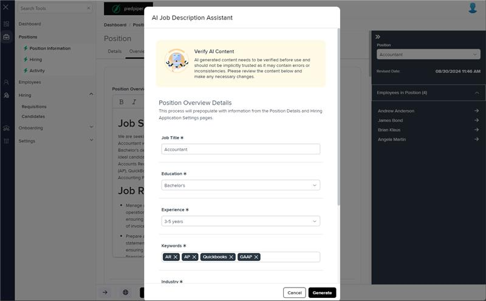
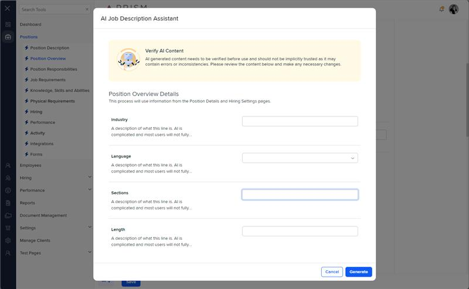

# Markup Audit Report

## Table of Contents

1. [File Paths](#file-paths)
2. [Unique Tags in Each File](#unique-tags-in-each-file)
3. [Differences in Markup Structure](#differences-in-markup-structure)
   - [Modal Configuration](#modal-configuration)
   - [Message Panel](#message-panel)
   - [Settings Table](#settings-table)
   - [Settings Rows](#settings-rows)
4. [Summary](#summary)

## File Paths

- `job-description-builder.component.html` belongs to the "AgileHR" project.
- The provided markup snippet belongs to the "Mocks-Talent-ng" project.

## Unique Tags in Each File

- **job-description-builder.component.html (AgileHR):**

  - `talent-loading`, `input-text`, `input-dropdown`, `input-dropdown-multi`

- **Mocks-Talent-ng:**
  - `input-text`, `input-dropdown`, `input-dropdown-multi`

## Differences in Markup Structure

### Modal Configuration

- **AgileHR:**

  - Uses `<modal-base *hasFeature="[Features.aiIntegration]" [config]="config" [template]="content"></modal-base>`.

- **Mocks-Talent-ng:**
  - Uses `<modal-base [config]="aiModal" [template]="editSetupContent"></modal-base>`.

### Message Panel

- **AgileHR:**

  - Uses `<message-panel title="Verify AI Content" content="AI generated content needs to be verified before use and should not be implicitly trusted as it may contain errors or inconsistencies. Please review the content below and make any necessary changes." [state]="MessagePanelState.WARNING"></message-panel>`.

- **Mocks-Talent-ng:**
  - Uses `<message-panel [title]="'Verify AI Content'" [content]="'AI generated content needs to be verified before use and should not be implicitly trusted as it may contain errors or inconsistencies. Please review the content below and make any necessary changes.'" [state]="1" [config]="{ dismissible: false }"></message-panel>`.

### Settings Table

- **AgileHR:**

  - Uses `<settings-table settingsTitle="Position Overview Details" [formGroup]="form">`.

- **Mocks-Talent-ng:**
  - Uses `<settings-table [settingsTitle]="'Position Overview Details'">`.

### Settings Rows

- **AgileHR:**

  - Includes multiple `<settings-row>` elements with titles such as "Job Title", "Education", "Experience", "Keywords", "Industry", "Language", and "Sections".
  - Uses `input-text`, `input-dropdown`, and `input-dropdown-multi` within `settings-row`.

- **Mocks-Talent-ng:**
  - Includes multiple `<settings-row>` elements with titles such as "Industry", "Language", "Sections", and "Length".
  - Uses `input-text`, `input-dropdown`, and `input-dropdown-multi` within `settings-row`.
  - Each `settings-row` includes a `description` attribute to provide additional information.

## Summary

The primary differences between the two files are in the use of modal configuration, message panels, settings tables, and settings rows. The `job-description-builder.component.html` file from "AgileHR" uses a specific modal configuration with a feature flag, includes a `talent-loading` component, and uses `settings-row` elements without descriptions. The provided markup snippet from "Mocks-Talent-ng" uses a different modal configuration, includes descriptions within `settings-row` elements, and does not include a `talent-loading` component.

Additional Notes:
The job-description-builder.component is not its own component in mocks-talent-ng, but is a modal within the pospo-deets.component.html file.

## Prod Screenshots

## Mocks Screenshots

## Prod URL

[link to the page in prod](https://piedpiper.agilehr.net/core/positions/position_7qw8tbqzn0xr8stpr01mx6tna3/info/overview)

## Mocks URL

[link to the page in mock](http://localhost:4340/positions/:id/pos-po)
