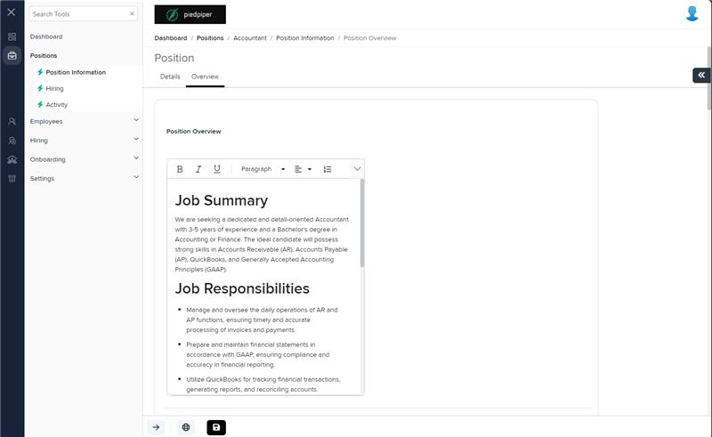
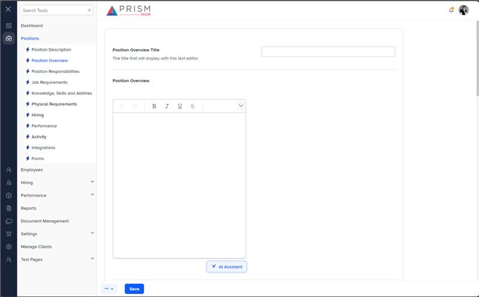

# Markup Audit Report

## Table of Contents

1. [File Paths](#file-paths)
2. [Unique Tags in Each File](#unique-tags-in-each-file)
3. [Differences in Markup Structure](#differences-in-markup-structure)
   - [Form Group](#form-group)
   - [Input Components](#input-components)
   - [AI Assistant Button](#ai-assistant-button)
   - [Modal Content](#modal-content)
4. [Summary](#summary)

## File Paths

- `overview.component.html` belongs to the "AgileHR" project.
- `pospo-deets.component.html` belongs to the "Mocks-Talent-ng" project.

## Unique Tags in Each File

- **overview.component.html (AgileHR):**

  - `fieldset`, `div`, `job-description-builder`

- **pospo-deets.component.html (Mocks-Talent-ng):**
  - `settings-table`, `settings-row`, `input-text`, `modal-base`, `message-panel`, `input-dropdown`, `input-dropdown-multi`

## Differences in Markup Structure

### Form Group

- **AgileHR:**

  - Uses a `fieldset` with a `[formGroup]` directive to group form controls and manage form state.
  - Includes a `div` with `formGroupName="positionOverview"` to further group related form controls.

- **Mocks-Talent-ng:**
  - Does not include any form group or fieldset elements.

### Input Components

- **AgileHR:**

  - Uses `input-rich-text` within `settings-row` for various sections such as Position Overview, Benefits Overview, Advertisement, Position Responsibilities, Performance Measurement, Knowledge, Skills and Abilities, and Physical Requirements.
  - Attributes include:
    - `[form]="positionForm.get('positionOverview')"`
    - `formControlName="overview"`, `formControlName="benefitsOverview"`, `formControlName="advertisement"`, `formControlName="responsibilities"`, `formControlName="performanceMeasurement"`, `formControlName="knowledgeSkillsAbilities"`, `formControlName="physicalRequirements"`
    - `cssClass="rte-override"`
    - `[toolbarSettings]="editorTools"`

- **Mocks-Talent-ng:**
  - Uses `input-text` within `settings-row` for Position Overview Title and Benefits Overview Title.
  - Uses `input-rich-text` within `settings-row` for Position Overview, Benefits Overview, Advertisement, and Disclaimer.
  - Uses `input-dropdown` and `input-dropdown-multi` within `settings-row` for Industry, Language, Sections, and Length.

### AI Assistant Button

- **AgileHR:**

  - Includes a `button-base` within `settings-row` for AI Assistant.
  - Attributes include:
    - `*hasFeature="[Features.aiIntegration]"`
    - `[title]="'AI Assistant'"`
    - `[tooltip]="'AI-powered job description writer'"`
    - `[class]="['ghost']"`
    - `[iconClass]="'prism-icons-AI'"`
    - `(click)="onAiAssistantClick()"`

- **Mocks-Talent-ng:**
  - Includes a `button-base` within `settings-row` for AI Assistant.
  - Attributes include:
    - `[title]="'AI Assistant'"`
    - `[tooltip]="'AI-powered job description writer'"`
    - `[class]="['ghost']"`
    - `[iconClass]="'prism-icons-AI'"`
    - `(click)="openAI()"`
    - `onKeyPress=""`, `onKeyDown=""`, `onKeyUp=""`

### Modal Content

- **AgileHR:**

  - Includes a `job-description-builder` component for AI Assistant modal.
  - Attributes include:
    - `(onConfirm)="onAiAssistantConfirm()"`
    - `(onCancel)="onAiAssistantCancel()"`
    - `[visible]="aiAssistantIsVisible"`
    - `[form]="aiAssistantForm"`
    - `[isLoading]="isAiAssistantThinking"`
    - `[tagData]="tagData"`
    - `[educationData]="educationData"`
    - `[experienceData]="experienceData"`

- **Mocks-Talent-ng:**
  - Includes a `modal-base` component with `ng-template` for AI Assistant modal.
  - Uses `message-panel` within `ng-template` for displaying a message.
  - Uses `settings-table` and `settings-row` within `ng-template` for additional input fields such as Industry, Language, Sections, and Length.

## Summary

The primary differences between the two files are in the use of form groups, input components, AI Assistant buttons, and modal content. The `overview.component.html` file from "AgileHR" uses a `fieldset` with a `[formGroup]` directive, `input-rich-text` for various sections, and includes a `job-description-builder` component for the AI Assistant modal. The `pospo-deets.component.html` file from "Mocks-Talent-ng" uses `settings-table` and `settings-row` for organizing input fields, `input-text` and `input-rich-text` for various sections, and includes a `modal-base` component with `ng-template` for the AI Assistant modal.

## Prod Screenshots

## Mocks Screenshots

## Prod URL

[link to the page in prod](https://piedpiper.agilehr.net/core/positions/position_7qw8tbqzn0xr8stpr01mx6tna3/info/overview)

## Mocks URL

[link to the page in mock](http://localhost:4340/positions/:id/pos-po)
