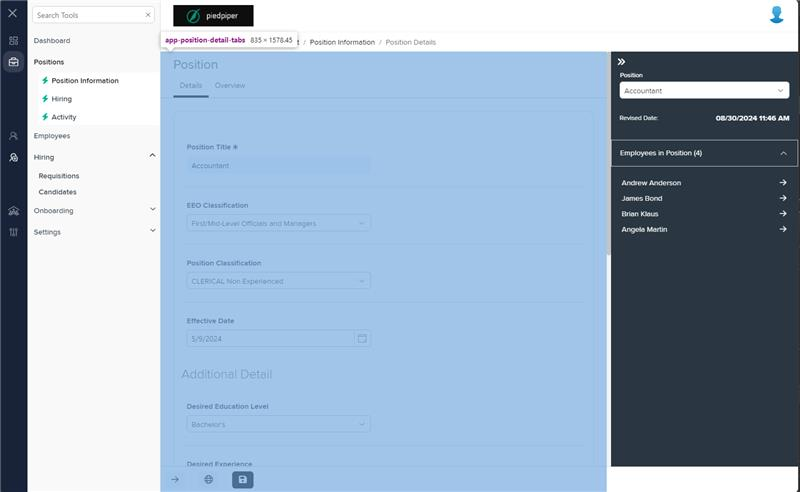

# Markup Audit Report

## Table of Contents

1. [File Paths](#file-paths)
2. [Unique Tags in Each File](#unique-tags-in-each-file)
3. [Differences in Markup Structure](#differences-in-markup-structure)
   - [Header Section](#header-section)
   - [Navigation and Tabs](#navigation-and-tabs)
4. [Summary](#summary)

## File Paths

- `position-detail-tabs.component.html` belongs to the "AgileHR" project.
- The file from "Mocks-Talent-ng" was not found.

## Unique Tags in Each File

- **position-detail-tabs.component.html (AgileHR):**

  - `page-title`, `navigation-tab`, `router-outlet`

- **Mocks-Talent-ng:**
  - Not available

## Differences in Markup Structure

### Header Section

- **AgileHR:**

  - Uses `<page-title title="Position"></page-title>` for the header.

- **Mocks-Talent-ng:**
  - Not available

### Navigation and Tabs

- **AgileHR:**

  - Uses `<navigation-tab></navigation-tab>` for navigation.
  - Uses `<router-outlet></router-outlet>` for routing and displaying components.

- **Mocks-Talent-ng:**
  - Not available

## Summary

The primary differences between the two files are in the use of header sections and navigation/tabs. The `position-detail-tabs.component.html` file from "AgileHR" uses a simple header, navigation tab, and router outlet for displaying components. The file from "Mocks-Talent-ng" was not found, so no comparison can be made.

Additional Notes:
This is a component used only in AgileHR and not in Mocks-Talent-ng. In Mocks-Talent-ng, this component resides within the pos-desc.component markup, which is equivalent to position-detail.component in AgileHR.

## Prod Screenshots

## Mocks Screenshots

Not Found

## Prod URL

[link to the page in prod](https://piedpiper.agilehr.net/core/positions/position_7qw8tbqzn0xr8stpr01mx6tna3/info/details)

## Mocks URL

Not Found
