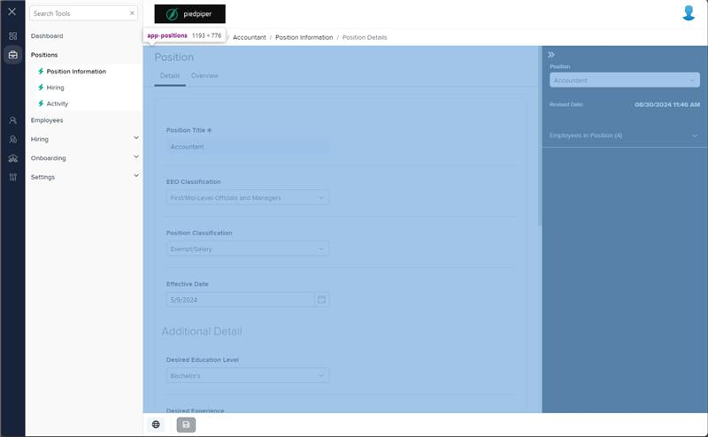
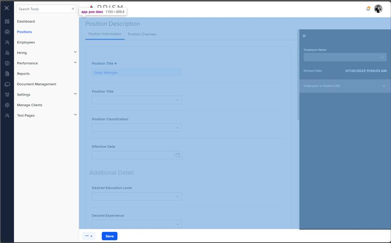

# Markup Audit Report

## Table of Contents

1. [File Paths](#file-paths)
2. [Unique Tags in Each File](#unique-tags-in-each-file)
3. [Differences in Markup Structure](#differences-in-markup-structure)
   - [Header Section](#header-section)
   - [Footer Section](#footer-section)
   - [Drawer Layout](#drawer-layout)
   - [Tabs and Content](#tabs-and-content)
   - [Loading Indicator](#loading-indicator)
   - [Modal Configuration](#modal-configuration)
4. [Summary](#summary)

## File Paths

- `positions-detail.component.html` belongs to the "AgileHR" project.
- `pos-desc.component.html` belongs to the "Mocks-Talent-ng" project.

## Unique Tags in Each File

- **positions-detail.component.html (AgileHR):**

  - `talent-footer`, `talent-loading`, `talent-position-drawer`, `modal-base`, `ng-template`

- **pos-desc.component.html (Mocks-Talent-ng):**
  - `page-title`, `layout-drawers`, `layout-drawer-center`, `ejs-tab`, `e-tabitems`, `e-tabitem`, `ng-template`, `layout-drawer-right`, `layout-toolbox`, `app-pos-drawer`, `app-pos-bi`, `app-pos-po`

## Differences in Markup Structure

### Header Section

- **AgileHR:**

  - Does not include a header section.

- **Mocks-Talent-ng:**
  - Uses `<page-title [title]="'Position Description'"></page-title>` for the header.

### Footer Section

- **AgileHR:**

  - Uses `<talent-footer>` with various attributes and event bindings for custom buttons, navigation, and save functionality.

- **Mocks-Talent-ng:**
  - Does not include a footer section.

### Drawer Layout

- **AgileHR:**

  - Uses a custom drawer layout with `
`.
  - Includes a center drawer with `
` and a right drawer with `
`.
  - Uses `<talent-position-drawer>` within the right drawer.

- **Mocks-Talent-ng:**
  - Uses `<layout-drawers>` for the layout.
  - Includes a center drawer with `<layout-drawer-center>` and a right drawer with `<layout-drawer-right>`.
  - Uses `<app-pos-drawer>` within the right drawer toolbox.

### Tabs and Content

- **AgileHR:**

  - Uses `<router-outlet>` within the center drawer for routing and displaying components.

- **Mocks-Talent-ng:**
  - Uses `<ejs-tab>` for tab navigation within the center drawer.
  - Includes `<e-tabitems>` and `<e-tabitem>` for defining tab items.
  - Uses `<ng-template #content>` for tab content.
  - Includes `<app-pos-bi>` and `<app-pos-po>` components within tab content.

### Loading Indicator

- **AgileHR:**

  - Uses `<talent-loading [loading]="loading"></talent-loading>` to indicate loading state.

- **Mocks-Talent-ng:**
  - Does not include a loading indicator.

### Modal Configuration

- **AgileHR:**

  - Uses `<modal-base [config]="unsavedChangesModal" [template]="unsavedChangesContent"></modal-base>`.
  - Includes `<ng-template #unsavedChangesContent>` for modal content.

- **Mocks-Talent-ng:**
  - Does not include a modal configuration.

## Summary

The primary differences between the two files are in the use of header sections, footer sections, drawer layouts, tabs and content, loading indicators, and modal configurations. The `positions-detail.component.html` file from "AgileHR" uses a custom drawer layout, includes a footer section with various functionalities, a loading indicator, and a modal configuration for unsaved changes. The `pos-desc.component.html` file from "Mocks-Talent-ng" uses a more structured drawer layout with tab navigation and specific components within the tab content. It also includes a header section but does not have a footer section, loading indicator, or modal configuration.

## Prod Screenshots

## Mocks Screenshots

## Prod URL

[link to the page in prod](https://piedpiper.agilehr.net/core/positions/position_7qw8tbqzn0xr8stpr01mx6tna3/info/details)

## Mocks URL

[link to the page in mock](http://localhost:4340/positions/:id/pos-desc)
