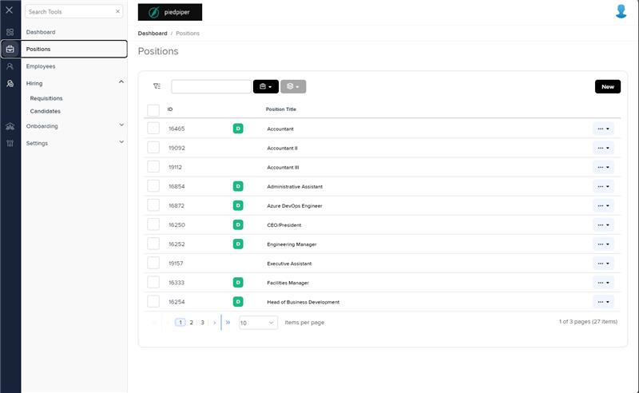
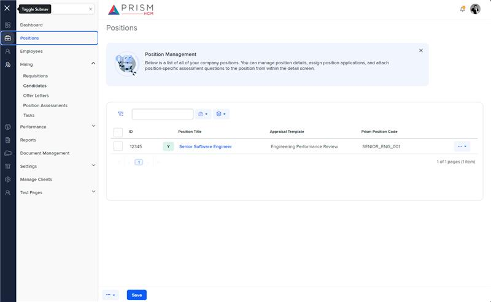

# Markup Audit Report

## Table of Contents

1. [File Paths](#file-paths)
2. [Unique Tags in Each File](#unique-tags-in-each-file)
3. [Differences in Markup Structure](#differences-in-markup-structure)
   - [Header Section](#header-section)
   - [Message Panel](#message-panel)
   - [Grid Filters](#grid-filters)
   - [Grid Component](#grid-component)
   - [Modals](#modals)
4. [Summary](#summary)

## File Paths

- `positions.component.html` belongs to the "AgileHR" project.
- `positions.component.html-1` belongs to the "Mocks-Talent-ng" project.

## Unique Tags in Each File

- **positions.component.html (AgileHR):**

  - `talent-grid`, `input-dropdown-multi`, `input-dropdown`, `e-columns`, `e-column`, `ejs-tooltip`, `modal-base`, `ng-template`

- **positions.component.html-1 (Mocks-Talent-ng):**
  - `message-panel`, `grid-filters`, `input-text`, `button-dropdown-grid`, `ejs-grid`, `popover`, `settings-table`, `settings-row`

## Differences in Markup Structure

### Header Section

- Both files use `<page-title [title]="'Positions'"></page-title>` for the header.

### Message Panel

- **AgileHR:**

  - Does not include a message panel.

- **Mocks-Talent-ng:**
  - Includes a `message-panel` with attributes for title, content, state, and config.

### Grid Filters

- **AgileHR:**

  - Uses `ng-template` for defining filter templates within `talent-grid`.
  - Includes `input-dropdown-multi` and `input-dropdown` for filters.

- **Mocks-Talent-ng:**
  - Uses `grid-filters` with `leftTemplate`, `centerTemplate`, and `centerHeaderTemplate`.
  - Includes `input-dropdown-multi` and `input-dropdown` within `ng-template` for filters.
  - Includes `input-text` for search and `button-dropdown-grid` for table tools and bulk actions.

### Grid Component

- **AgileHR:**

  - Uses `talent-grid` with various properties and events.
  - Includes `e-columns` and `e-column` for defining grid columns.
  - Uses `ejs-tooltip` for tooltips within grid columns.

- **Mocks-Talent-ng:**
  - Uses `ejs-grid` with properties like `enableAdaptiveUI`, `rowRenderingMode`, `allowPaging`, and `dataSource`.
  - Includes `e-columns` and `e-column` for defining grid columns.
  - Uses `popover` for tooltips within grid columns.

### Modals

- **AgileHR:**

  - Includes multiple `modal-base` components with `ng-template` for different actions (e.g., confirmation).
  - Uses `settings-table` and `settings-row` within modals.

- **Mocks-Talent-ng:**
  - Includes multiple `modal-base` components with `ng-template` for different actions (e.g., bulk actions, assign forms, advanced filters).
  - Uses `settings-table` and `settings-row` within modals.

## Summary

The primary differences between the two files are in the use of message panels, grid filters, grid components, and modals. The `positions.component.html` file from "AgileHR" uses `talent-grid` for the grid, `ng-template` for defining filter templates, and includes multiple `modal-base` components for various actions. The `positions.component.html-1` file from "Mocks-Talent-ng" includes a `message-panel`, uses `grid-filters` for defining filter templates, and uses `ejs-grid` for the grid. It also includes multiple `modal-base` components for various actions.

## Prod Screenshots

## Mocks Screenshots

## Prod URL

[link to the page in prod](https://piedpiper.agilehr.net/core/positions)

## Mocks URL

[link to the page in mock](http://localhost:4340/positions)
