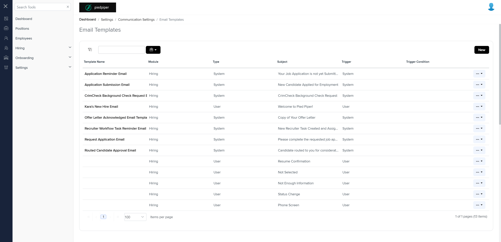

# Differences between `email-temp.component.html (Mocks)` and `email-templates.component.html (Production)`

## Table of Contents

-   [Relative Paths](#relative-paths)
-   [Differences](#differences)
-   [Prod Screenshots](#prod-screenshots)
-   [Mock Screenshots](#mock-screenshots)
-   [URL](#url)

### Relative Paths

-   **email-temp.component.html**: `components-ng-shared\projects\mocks-talent-ng\src\app\settings\email-temp\email-temp.component.html`
-   **email-templates.component.html**: `AgileHR\Talent\Talent.Web\ClientApp\src\app\settings\communication\email-templates\email-templates.component.html`

### Differences

#### components-ng-shared\projects\mocks-talent-ng\src\app\settings\email-temp\email-temp.component.html (Mock Environment)

-   Contains a `<page-title>` component with attribute `[title]`.
-   Contains a `<grid-filters>` component with attributes `[centerTemplate]` and `[centerHeaderTemplate]`.
-   Contains an `<ng-template>` with `#centerHeaderTemplate` and nested `
` with class `custom-toolbar`.
-   Contains an `<ng-template>` with `#centerContent` and nested `<ejs-grid>` component with attributes `[enableAdaptiveUI]`, `[rowRenderingMode]`, `[allowPaging]`, `[dataSource]`, and `(toolbarClick)`.
-   Contains multiple `<e-column>` components with fields `Module`, `Type`, `Subject`, `Trigger`, and `TriggerCondition`.
-   Contains a `<modal-base>` component with attributes `[config]` and `[template]` for `newTemplateModal`, `editTemplateModal`, and `deleteTemplateModal`.
-   Contains an `<ng-template>` with `#newTemplateContent` and nested `<settings-table>` component.
-   Contains an `<ng-template>` with `#editTemplateContent` and nested `<settings-table>` component.
-   Contains an `<ng-template>` with `#deleteContent` and nested `
` with class `row`.

#### AgileHR\Talent\Talent.Web\ClientApp\src\app\settings\communication\email-templates\email-templates.component.html (Production)

-   Contains a `<talent-grid>` component with attributes `[allowBulkActions]`, `[allowFiltering]`, `[allowNew]`, `[allowNewDisabled]`, `[allowRowSelect]`, `[data]`, `exportFileName`, `[filters]`, `[filtersForm]`, `[friendlyName]`, `[initializing]`, `[loading]`, `[searchFields]`, `[selectActionTooltip]`, `(applyFilters)`, `(rowSelected)`, and `(selected)`.
-   Contains an `<ng-template>` with `#filtersTemplate` and nested `<input-dropdown-multi>` components.
-   Contains an `<ng-template>` with `#template` and nested `<ejs-tooltip>` and `<a>` components.
-   Contains multiple `<e-column>` components with fields `templateName`, `module`, `type`, `subject`, `trigger`, and `triggerCondition`.
-   Contains a `<modal-base>` component with attributes `[config]` and `[template]` for `archievePopupConfig` and `unarchievePopupConfig`.
-   Contains an `<ng-template>` with `#dropdownActionbutton` and nested `<button-dropdown-grid>` component.
-   Contains a `<modal-drawer>` component with attributes `[open]`, `[showButton]`, and `[template]`.
-   Contains an `<ng-template>` with `#addEditEmailTemplate` and nested `<talent-new-edit-email-template>` component.

### Production Screenshots

### Mock Screenshots

### URL

[link to the page in prod](https://piedpiper.agilehr.net/core/settings/communication/email-templates)

[link to the page in mock environment](http://localhost:4340/settings/email-templates)
