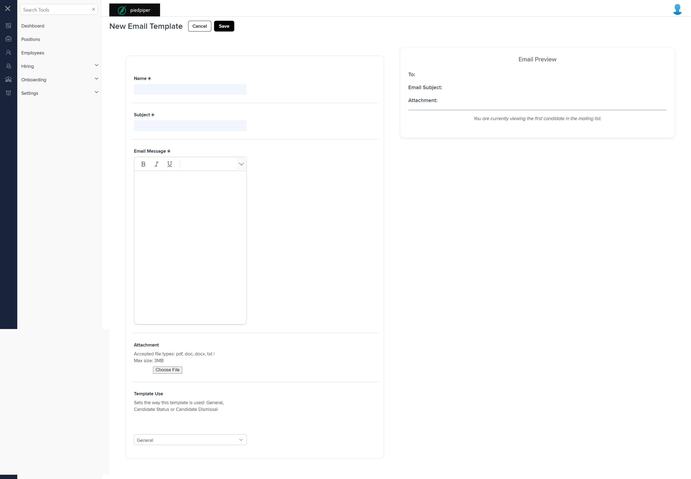
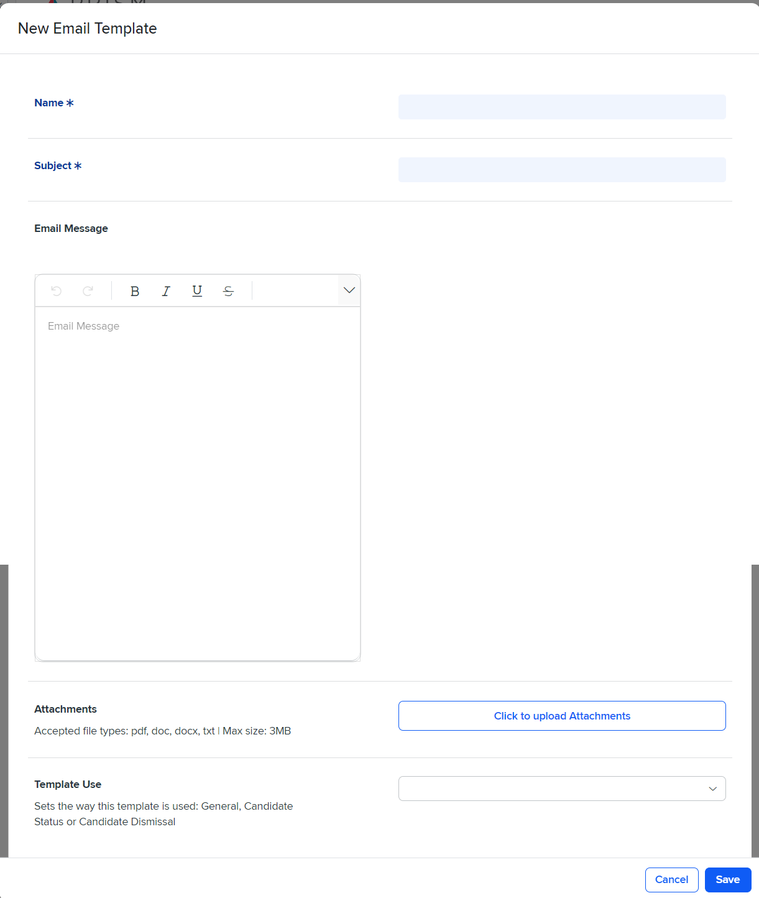

# Differences between `email-temp.component.html` and `new-edit-email-template.component.html`

## Table of Contents

-   [Relative Paths](#relative-paths)
-   [Differences](#differences)
-   [Prod Screenshots](#prod-screenshots)
-   [Mock Screenshots](#mock-screenshots)
-   [URL](#url)

### Relative Paths

-   **email-temp.component.html (Mock Environment)**: `components-ng-shared\projects\mocks-talent-ng\src\app\settings\email-temp\email-temp.component.html`
-   **new-edit-email-template.component.html (Production)**: `AgileHR\Talent\Talent.Web\ClientApp\src\app\settings\communication\email-templates\new-edit-email-template\new-edit-email-template.component.html`

### Differences

#### email-temp.component.html (Mock Environment)

-   Contains a `<page-title>` component with a `[title]` attribute set to `'Email Templates'`.
-   Contains a `<grid-filters>` component with `[centerTemplate]` and `[centerHeaderTemplate]` attributes.
-   Contains a `
` with class `custom-toolbar` inside an `<ng-template>` with `#centerHeaderTemplate`.
-   Contains a `<button-dropdown-grid>` component with `[items]`, `tooltip`, `[callback]`, and `[icon]` attributes inside the `custom-toolbar` div.
-   Contains a `<button-base>` component with `[title]`, `[tooltip]`, `[isPrimary]`, and `(click)` attributes inside the `custom-toolbar` div.
-   Contains an `<ejs-grid>` component with `[enableAdaptiveUI]`, `[rowRenderingMode]`, `[allowPaging]`, `[dataSource]`, and `(toolbarClick)` attributes.
-   Contains multiple `<e-column>` components inside the `<ejs-grid>` component.
-   Contains multiple `<ng-template>` elements with `#editbutton`, `#evaluateStatus`, `#itemStatus`, and `#searchbar`.
-   Contains multiple `<modal-base>` components with `[config]` and `[template]` attributes.
-   Contains multiple `<settings-table>` components inside `<ng-template>` elements with `#newTemplateContent`, `#editTemplateContent`, and `#deleteContent`.

#### new-edit-email-template.component.html (Production)

-   Contains a `{{ emailTemplateHeading }}` interpolation.
-   Contains a `
` with class `modal-drawer__cta`.
-   Contains a `<button-base>` component with `[title]`, `[isPrimary]`, and `(onClick)` attributes inside the `modal-drawer__cta` div.
-   Contains a `
` with class `card card--split` and `[formGroup]` attribute.
-   Contains multiple `<settings-row>` components inside a `<settings-table>` component with `[title]`, `[required]`, `[description]`, and `[type]` attributes.
-   Contains multiple `<input-text>` components with `[form]`, `formControlName`, `[required]`, and `[placeholder]` attributes inside the `<settings-row>` components.
-   Contains an `<input-rich-text>` component with `id`, `cssClass`, `(created)`, `[form]`, `formControlName`, and `[toolbarSettings]` attributes inside a `<settings-row>` component.
-   Contains an `<input-dropdown>` component with `[data]`, `[placeholder]`, `[form]`, `formControlName`, and `(optionSelected)` attributes inside a `<settings-row>` component.
-   Contains an `<input-dropdown-multi>` component with `(optionsSelected)`, `[form]`, `formControlName`, `[data]`, `[enableFiltering]`, `mode`, `ngDefaultControl`, `showSelectAll`, and `placeholder` attributes inside a `<settings-row>` component.
-   Contains a `
` with class `offer-letter__title` and `offer-letter__body`.
-   Contains multiple `
` elements with class `offer-letter__name` and interpolation bindings to `emailTemplateForm.controls` values.
-   Contains a `
` with class `viewing-First-Candidate` and text content.
-   Contains a `
` with class `disabled` and `[innerHTML]` attribute.

### Prod Screenshots

### Mock Screenshots

### URL

[link to the page in prod](https://piedpiper.agilehr.net/core/settings/communication/email-templates)

[link to the page in mock environment](http://localhost:4340/email-temp)
