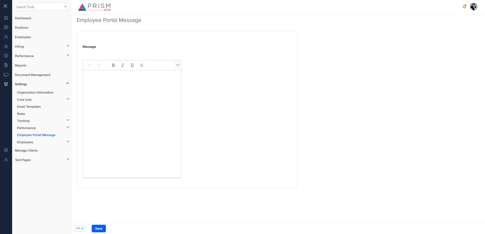
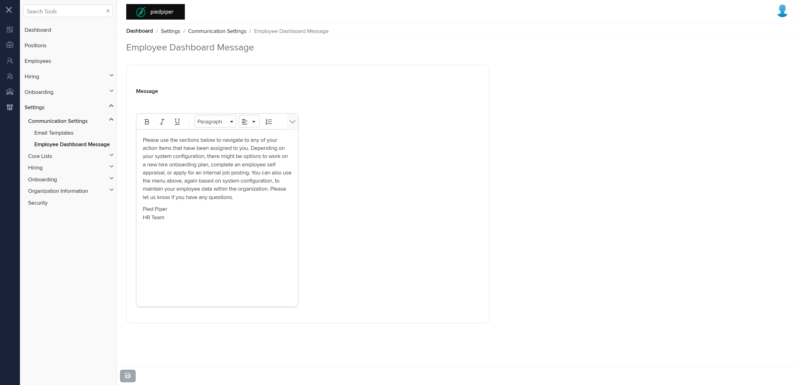

# Differences between `s-employee-portal-message.component.html` (Mocks) and `emp-dashboard.component.html` (Production)

## Table of Contents

-   [Relative Paths](#relative-paths)
-   [Differences](#differences)
-   [Mock Screenshots](#mock-screenshots)
-   [Prod Screenshots](#prod-screenshots)
-   [URL](#url)

### Relative Paths

-   **s-employee-portal-message.component.html**: `components-ng-shared\projects\mocks-talent-ng\src\app\settings\s-employee-portal-message\s-employee-portal-message.component.html`
-   **emp-dashboard.component.html**: `AgileHR\Talent\Talent.Web\ClientApp\src\app\settings\communication\emp-dashboard\emp-dashboard.component.html`

### Differences

#### AgileHR\Talent\Talent.Web\ClientApp\src\app\settings\communication\emp-dashboard\emp-dashboard.component.html

-   Contains a `<page-title>` component with attribute `[title]`.
-   Contains a `<settings-table>` component.
-   Contains a `<settings-row>` component with attributes `[title]`, `[description]`, `[required]`, and `[type]`.
-   Contains an `<input-rich-text>` component.

#### components-ng-shared\projects\mocks-talent-ng\src\app\settings\s-employee-portal-message\s-employee-portal-message.component.html

-   Contains a `<talent-footer>` component with attributes `[nextVisible]`, `[prevVisible]`, `(saveClicked)`, `[saveEnabled]`, and `[saveVisible]`.
-   Contains a `<settings-table>` component.
-   Contains a `<settings-row>` component with attributes `[title]`, `[description]`, `[required]`, and `[type]`.
-   Contains an `<input-rich-text>` component with attributes `id`, `[toolbarSettings]`, `[form]`, and `formControlName`.

### Mock Screenshots

### Prod Screenshots

### URL

[link to the page in mock environment](http://localhost:4340/settings/s-employee-portal-message)

[link to the page in prod](https://piedpiper.agilehr.net/core/settings/communication/emp-dashboard)
