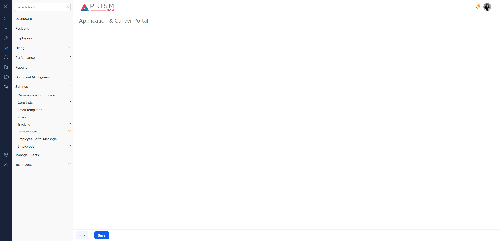

# Differences between `app-career-portal.component.html` (Production) and `track-acp.component.html` (Mock Environment)

## Table of Contents

-   [Relative Paths](#relative-paths)
-   [Differences](#differences)
-   [Mock Screenshots](#mock-screenshots)
-   [Prod Screenshots](#prod-screenshots)
-   [URL](#url)

### Relative Paths

-   **app-career-portal.component.html**: `AgileHR\Talent\Talent.Web\ClientApp\src\app\settings\hiring\app-career-portal\app-career-portal.component.html`
-   **track-acp.component.html**: `components-ng-shared\projects\mocks-talent-ng\src\app\settings\tracking\track-acp\track-acp.component.html`

### Differences

#### AgileHR\Talent\Talent.Web\ClientApp\src\app\settings\hiring\app-career-portal\app-career-portal.component.html

-   Contains an `<app-settings>` component.
-   Contains a commented-out `<ejs-tab>` component with `id="adaptiveTab"` and `overflowMode="Popup"`.
-   The commented-out `<ejs-tab>` contains an `<e-tabitems>` component with a single `<e-tabitem>` that has a `[header]` attribute and a nested `<ng-template>` with an `<app-settings>` component.

#### components-ng-shared\projects\mocks-talent-ng\src\app\settings\tracking\track-acp\track-acp.component.html

-   Contains an `<ejs-tab>` component with `id="adaptiveTab"` and `overflowMode="Popup"`.
-   The `<ejs-tab>` contains an `<e-tabitems>` component with multiple `<e-tabitem>` components.
-   The first `<e-tabitem>` has a `[header]` attribute and a nested `<ng-template>` with an `<app-st-aps>` component.
-   The second `<e-tabitem>` has a `[header]` attribute and a nested `<ng-template>` with an `<app-st-crs>` component.
-   The third `<e-tabitem>` has a `[header]` attribute and a nested `<ng-template>` with an `<app-st-cpapi>` component.

### Mock Screenshots

### Prod Screenshots

### URL

[link to the page in mock environment](http://localhost:4340/settings/tracking/application-career-portal)

[link to the page in prod](https://piedpiper.agilehr.net/core/settings/hiring/app-career-portal)
