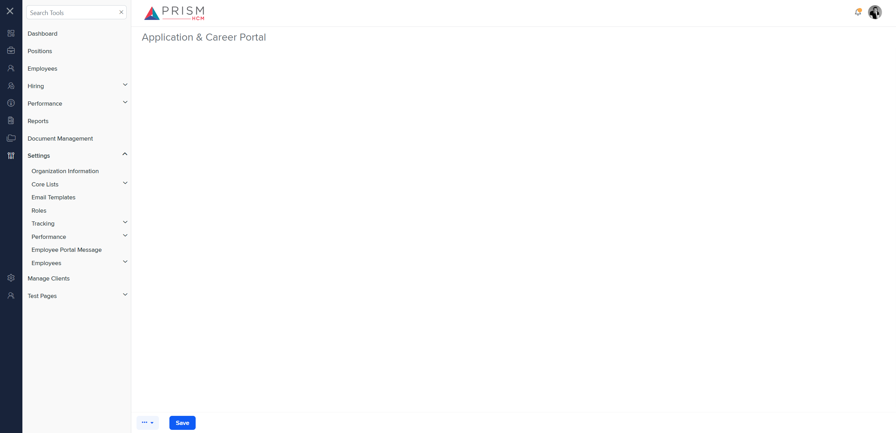

# Differences between `candidate-resources.component.html` (Production) and `st-crs.component.html` (Mocks)

## Table of Contents

-   [Relative Paths](#relative-paths)
-   [Differences](#differences)
-   [Mock Screenshots](#mock-screenshots)
-   [Prod Screenshots](#prod-screenshots)
-   [URL](#url)

### Relative Paths

-   **candidate-resources.component.html**: `AgileHR\Talent\Talent.Web\ClientApp\src\app\settings\hiring\app-career-portal\candidate-resources\candidate-resources.component.html`
-   **st-crs.component.html**: `components-ng-shared\projects\mocks-talent-ng\src\app\settings\tracking\track-acp\track-acp.component.html`

### Differences

#### AgileHR\Talent\Talent.Web\ClientApp\src\app\settings\hiring\app-career-portal\candidate-resources\candidate-resources.component.html

-   Contains a `<button-dropdown>` component with attributes `[items]`, `tooltip`, `[callback]`, and `[icon]`.
-   Contains a `<button-base>` component with attributes `[title]`, `[callback]`, `[tooltip]`, and `(click)`.
-   Contains multiple `<ng-template>` elements with `#printBtn`, `#pdfBtn`, `#csvBtn`, `#excelBtn`, `#copyBtn`, and `#advancedSearchBtn` identifiers, each containing a `<button-base>` component with attributes `[title]`, `[tooltip]`, `[isPrimary]`, `[class]`, `[iconClass]`, and `(click)`.
-   Contains a `<modal-base>` component with attributes `[config]` and `[template]` for `deleteModal`, `newTypeModal`, and `editSetupModal`.
-   Contains multiple `<ng-template>` elements with `#deleteContent`, `#newTypeContent`, and `#editSetupContent` identifiers, each containing a `<settings-table>` component with nested `<settings-row>` components.
-   The `<settings-row>` components contain either a `<settings-uploader>` or `<input-file>` component.

#### components-ng-shared\projects\mocks-talent-ng\src\app\settings\tracking\track-acp\track-acp.component.html

-   Contains a `<grid-filters>` component with attributes `[centerTemplate]` and `[centerHeaderTemplate]`.
-   Contains a `<button-dropdown-grid>` component with attributes `[items]`, `tooltip`, `[callback]`, and `[icon]`.
-   Contains a `<button-new>` component with attributes `[tooltip]`, `(click)`, `onKeyPress`, `onKeyDown`, and `onKeyUp`.
-   Contains an `<ejs-grid>` component with attributes `[enableAdaptiveUI]`, `[rowRenderingMode]`, `[allowPaging]`, and `[dataSource]`.
-   Contains multiple `<ng-template>` elements with `#centerHeaderTemplate`, `#centerContent`, `#editbutton`, `#searchbar`, `#deleteContent`, `#newTypeContent`, and `#editSetupContent` identifiers.
-   The `<ng-template>` elements contain various components such as `<button-base>`, `<input-text>`, `<settings-table>`, and `<settings-row>`.
-   The `<settings-row>` components contain either a `<settings-uploader>` or `<input-file>` component.

### This component is implemented in the mock environment, but not visible.

### Mock Screenshots

### This component is currently not implemented in production.

### Prod Screenshots

N/A

### URL

[link to the page in mock environment]http://localhost:4340/settings/tracking/application-career-portal)
