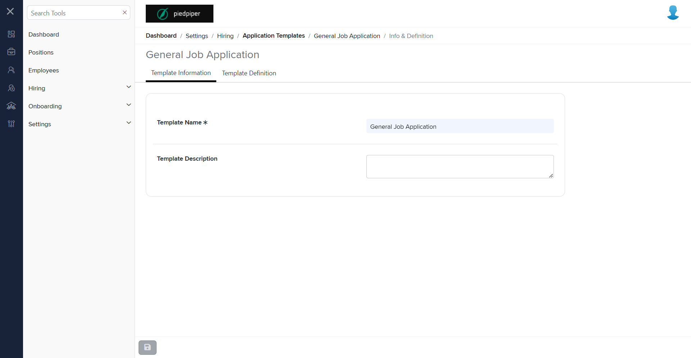

# Summary of `application-templates-detail.component.md`

## Table of Contents

-   [Relative Path](#relative-path)
-   [Summary](#summary)
-   [Mock Screenshots](#mock-screenshots)
-   [Prod Screenshots](#prod-screenshots)
-   [URL](#url)

### Relative Path

-   **application-templates-detail.component.md**: `AgileHR\Talent\Talent.Web\ClientApp\src\app\settings\hiring\application-templates\application-templates-detail\application-templates-detail.component.html`

### Summary

-   Contains a `<page-title>` component with a `[title]` attribute bound to `pageTitle`.
-   Contains a `<talent-footer>` component with attributes `[nextVisible]`, `[prevVisible]`, `(prevClicked)`, `(nextClicked)`, `[saveEnabled]`, `(saveClicked)`, and `[saveVisible]`.
-   Contains an `<ejs-tab>` component with `#tab`, `id="adaptiveTab"`, and `overflowMode="Popup"`.
-   The `<ejs-tab>` contains an `<e-tabitems>` component with two `<e-tabitem>` components.
-   The first `<e-tabitem>` has a `[header]` attribute bound to `tabHeadings[0]` and a nested `<ng-template>` with an `<app-application-templates-detail-information>` component.
-   The second `<e-tabitem>` has a `[header]` attribute bound to `tabHeadings[1]` and a nested `<ng-template>` with an `<app-application-templates-detail-definition>` component.
-   Contains a `<modal-base>` component with `[config]` and `[template]` attributes bound to `unsavedChangesModal` and `unsavedChangesContent`, respectively.
-   Contains an `<ng-template>` with `#unsavedChangesContent` and nested `
` elements for displaying a confirmation message.

### This component is currently not implemented in mock environment.

### Mock Screenshots

N/A

### Prod Screenshots

### URL

[link to the page in prod](https://piedpiper.agilehr.net/core/settings/hiring/applicationtemplates/candidateapptemplate)
