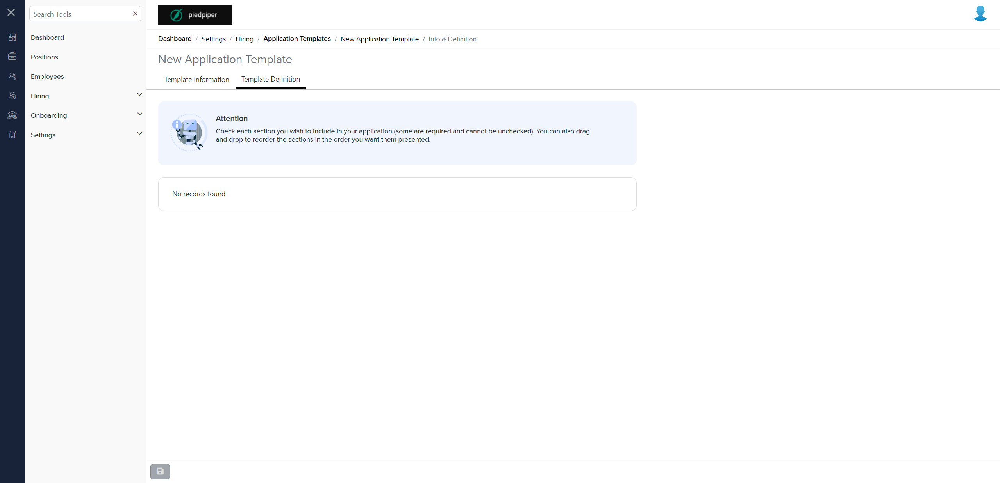

# Summary of `template-definition.component.html`

## Table of Contents

-   [Relative Path](#relative-path)
-   [Summary](#summary)
-   [Mock Screenshots](#mock-screenshots)
-   [Prod Screenshots](#prod-screenshots)
-   [URL](#url)

### Relative Path

-   **template-definition.component.html**: `AgileHR\Talent\Talent.Web\ClientApp\src\app\settings\hiring\application-templates\application-templates-detail\definition\template-definition.component.html`

### Summary

-   Contains a `<message-panel>` component with attributes `[title]`, `[content]`, and `[state]`.
-   The `[title]` attribute is set to `'Attention'`.
-   The `[content]` attribute provides instructions for including sections in the application and mentions that some sections are required and cannot be unchecked.
-   The `[state]` attribute is set to `0`.
-   Contains a `
` element with the class `definition-container`.
-   Inside the `
`, there is a `<fieldset>` element with a `[disabled]` attribute bound to `!isEditable`.
-   The `<fieldset>` contains an `<ejs-listbox>` component with attributes `[dataSource]`, `[allowDragAndDrop]`, and `(drop)`.
-   The `[dataSource]` attribute is bound to `data`.
-   The `[allowDragAndDrop]` attribute is bound to `isEditable`.
-   The `(drop)` event is bound to the `onDropData($event)` method.
-   Inside the `<ejs-listbox>`, there is an `<ng-template>` element with `#itemTemplate` and `let-data`.
-   The `<ng-template>` contains a `
` element with the class `definition-wrapper`.
-   Inside the `
`, there is an `<ejs-checkbox>` component with attributes `[id]`, `[(ngModel)]`, `[disabled]`, and `(change)`.
-   The `[id]` attribute is bound to `data.id`.
-   The `[(ngModel)]` attribute is bound to `data.isSelected`.
-   The `[disabled]` attribute is bound to `data.isLocked || !isEditable`.
-   The `(change)` event is bound to the `onCheckBoxChange($event)` method.
-   Next to the `<ejs-checkbox>`, there is a `` element with the class `settings__title definition-name`.
-   The `` element has a `[ngClass]` attribute bound to `{'required': data.isLocked}` and an `[innerText]` attribute bound to `data.text`.
-   Below the ``, there is a `
` element with the class `definition-description`.
-   Inside the `
`, there is another `` element with an `[innerHTML]` attribute bound to `data.description`.

### This component is currently not implemented in mock environment.

### Mock Screenshots

N/A

### Prod Screenshots

### URL

[link to the page in prod](https://piedpiper.agilehr.net/core/settings/hiring/applicationtemplates/candidateapptemplate)
