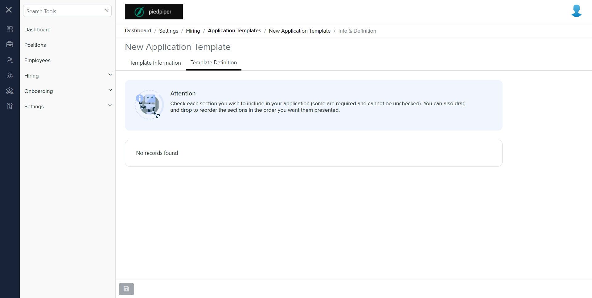

# Summary of `template-information.component.html`

## Table of Contents

-   [Relative Path](#relative-path)
-   [Summary](#summary)
-   [Mock Screenshots](#mock-screenshots)
-   [Prod Screenshots](#prod-screenshots)
-   [URL](#url)

### Relative Path

-   **template-information.component.html**: `AgileHR\Talent\Talent.Web\ClientApp\src\app\settings\hiring\application-templates\application-templates-detail\information\template-information.component.html`

### Summary

-   Contains an `<ng-template>` element with `#infoTemplate`.
-   Inside the `<ng-template>`, there is an `<ng-container>` element with a `[formGroup]` attribute bound to `applicationTemplateForm`.
-   The nested `<ng-container>` has a `formGroupName` attribute set to `"information"`.
-   Contains a `<settings-table>` component.
-   Inside the `<settings-table>`, there are two `<settings-row>` components.
-   The first `<settings-row>` component has attributes `[title]` set to `'Template Name'`, `[description]` set to an empty string, and `[required]` set to `true`.
-   Inside the first `<settings-row>`, there is an `<input-text>` component with attributes `[form]` bound to `applicationTemplateForm.get('information')`, `formControlName` set to `"name"`, and `[required]` set to `true`.
-   The second `<settings-row>` component has attributes `[title]` set to `'Template Description'` and `[description]` set to an empty string.
-   Inside the second `<settings-row>`, there is an `<input-multiline>` component with attributes `[form]` bound to `applicationTemplateForm.get('information')` and `formControlName` set to `"description"`.
-   Contains two `<fieldset>` elements.
-   The first `<fieldset>` element has an `*ngIf` directive bound to `!isEditable` and a `disabled` attribute set to `"disabled"`.
-   Inside the first `<fieldset>`, there is an `<ng-container>` element with an `*ngTemplateOutlet` directive bound to `infoTemplate`.
-   The second `<fieldset>` element has an `*ngIf` directive bound to `isEditable`.
-   Inside the second `<fieldset>`, there is an `<ng-container>` element with an `*ngTemplateOutlet` directive bound to `infoTemplate`.

### This component is currently not implemented in mock environment.

### Mock Screenshots

N/A

### Prod Screenshots

### URL

[link to the page in prod](https://piedpiper.agilehr.net/template-information)
