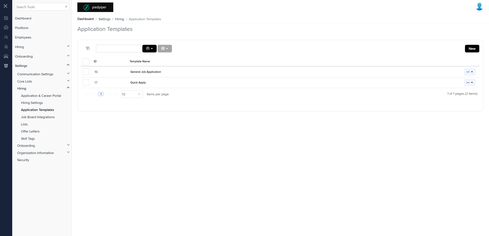

# Summary of `application-templates.component.md`

## Table of Contents

-   [Relative Path](#relative-path)
-   [Summary](#summary)
-   [Mock Screenshots](#mock-screenshots)
-   [Prod Screenshots](#prod-screenshots)
-   [URL](#url)

### Relative Path

-   **application-templates.component.md**: `AgileHR\Talent\Talent.Web\ClientApp\src\app\settings\hiring\application-templates\application-templates.component.html`

### Summary

-   Contains a `<page-title>` component with a `[title]` attribute set to `'Application Templates'`.
-   Contains a `<talent-grid>` component with various attributes and event bindings such as `[allowNew]`, `[allowRowSelect]`, `(applyFilters)`, `(bulk)`, `[bulkActionTooltip]`, `[bulkOptions]`, `[data]`, `friendlyName`, `exportFileName`, `[filters]`, `[filtersForm]`, `[initializing]`, `(initialized)`, `[searchFields]`, `(selected)`, `(filtersReset)`, `(rowSelected)`, `[selectActionTooltip]`, `[selectOptions]`, and `idProperty`.
-   Contains an `<ng-template>` with `#filtersTemplate` and nested `<input-dropdown-multi>` and `<input-dropdown>` components for filtering.
-   Contains an `<e-columns>` component with multiple `<e-column>` components.
-   The `<e-column>` components have attributes such as `field`, `headerText`, and `width`.
-   One of the `<e-column>` components contains an `<ng-template>` with a `*hasKey` directive and nested `<ejs-tooltip>` and `<a>` components.
-   Contains a `<modal-base>` component with `[config]` and `[template]` attributes for `confirmationPopupConfig`.
-   Contains an `<ng-template>` with `#confirmationContent` and nested `
` elements for confirmation messages.

### This component is currently not implemented in the mock environment.

### Mock Screenshots

N/A

### Prod Screenshots

### URL

[link to the page in prod](https://piedpiper.agilehr.net/core/settings/hiring/applicationtemplates)
