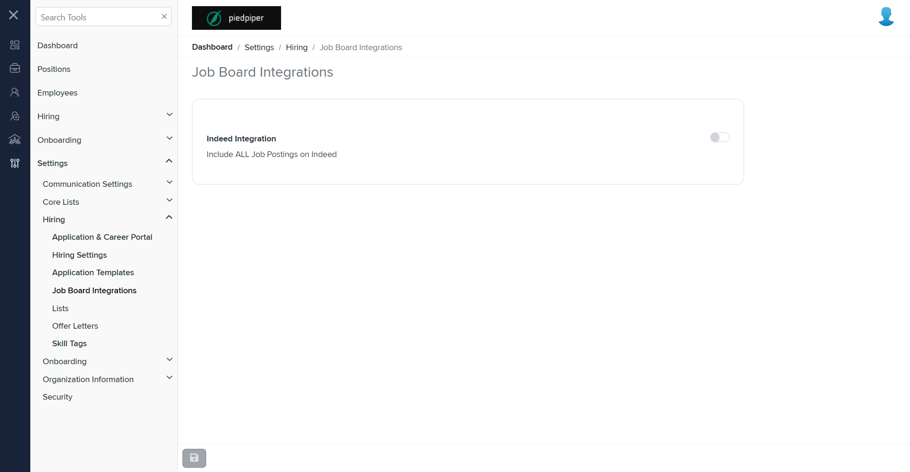

# Summary of `job-board-integrations.component.html`

## Table of Contents

-   [Relative Path](#relative-path)
-   [Summary](#summary)
-   [Mock Screenshots](#mock-screenshots)
-   [Prod Screenshots](#prod-screenshots)
-   [URL](#url)

### Relative Path

-   **job-board-integrations.component.html**: `path/to/job-board-integrations.component.html`

### Summary

-   Contains a `<page-title>` component with a `[title]` attribute set to `'Job Board Integrations'`.
-   Contains a `<talent-footer>` component with attributes `[nextVisible]`, `[prevVisible]`, `(saveClicked)`, `[saveEnabled]`, and `[saveVisible]`.
-   The `[nextVisible]` and `[prevVisible]` attributes are set to `false`.
-   The `(saveClicked)` event is bound to the `save()` method.
-   The `[saveEnabled]` attribute is bound to `saveEnabled`.
-   The `[saveVisible]` attribute is bound to `isEditable`.
-   Contains a `<fieldset>` element with a `[formGroup]` attribute bound to `hiringSettingForm`.
-   Inside the `<fieldset>`, there is a `<settings-table>` component.
-   The `<settings-table>` contains a `<settings-row>` component with attributes `[title]`, `[description]`, and `[required]`.
-   The `[title]` attribute is set to `'Indeed Integration'`.
-   The `[description]` attribute is set to `'Include ALL Job Postings on Indeed'`.
-   The `[required]` attribute is set to an empty string.
-   Inside the `<settings-row>`, there is a `<toggle-switch>` component with attributes `[form]`, `formControlName`, and `[enabled]`.
-   The `[form]` attribute is bound to `hiringSettingForm`.
-   The `formControlName` attribute is set to `"indeedEnabled"`.
-   The `[enabled]` attribute is bound to `isEditable`.

### This component is currently not implemented in mock environment.

### Mock Screenshots

N/A

### Prod Screenshots

### URL

[link to the page in prod](https://piedpiper.agilehr.net/core/settings/hiring/job-board-integrations)
