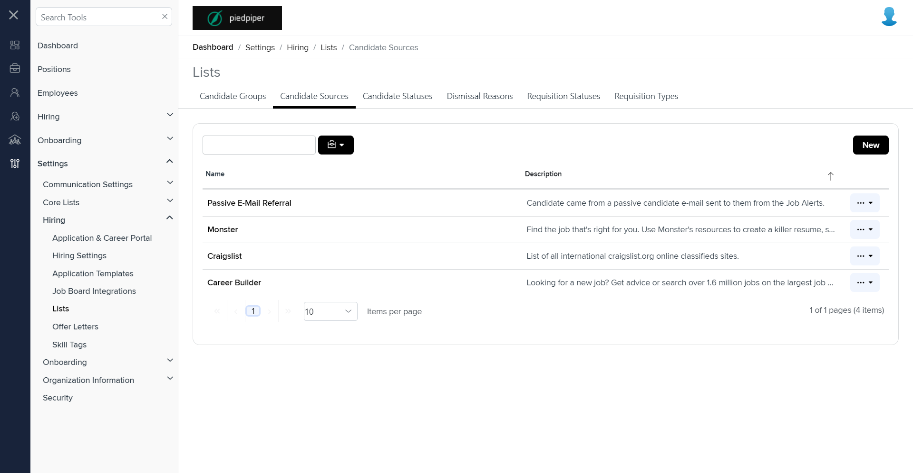

# Summary of `candidate-sources.component.html`

## Table of Contents

-   [Relative Path](#relative-path)
-   [Summary](#summary)
-   [Mock Screenshots](#mock-screenshots)
-   [Prod Screenshots](#prod-screenshots)
-   [URL](#url)

### Relative Path

-   **candidate-sources.component.html**: `AgileHR\Talent\Talent.Web\ClientApp\src\app\settings\hiring\lists\candidate-sources\candidate-sources.component.html`

### Summary

-   Contains a `<talent-grid>` component with various attributes and event bindings such as `[allowFiltering]`, `[allowBulkActions]`, `[allowRowSelect]`, `[allowNew]`, `[data]`, `[friendlyName]`, `exportFileName`, `[initializing]`, `(selected)`, `[selectActionTooltip]`, `[selectOptions]`, and `[searchFields]`.
-   The `<talent-grid>` contains an `<e-columns>` component with two `<e-column>` components.
-   The first `<e-column>` component has attributes `field` set to `"name"` and `headerText` set to `"Name"`.
-   The first `<e-column>` component contains an `<ng-template>` with a `*hasKey` directive and a `#template` identifier.
-   The `<ng-template>` contains an `<ejs-tooltip>` component with a `[content]` attribute.
-   Inside the `<ejs-tooltip>`, there is an `<a>` element with a `class` attribute set to `'grid-link disable-row-select'` and a `(click)` event bound to the `onLinkClicked($event, data)` method.
-   The second `<e-column>` component has attributes `field` set to `"description"` and `headerText` set to `"Description"`.
-   Contains a `<modal-base>` component with `[config]` and `[template]` attributes for `createEditJobSrcChannelModal` and `newTypeContent`, respectively.
-   Contains an `<ng-template>` with `#newTypeContent` and a `[formGroup]` attribute bound to `createEditJobSourceChannelFormGroup`.
-   The `<ng-template>` contains a `<settings-table>` component with two nested `<settings-row>` components.
-   The first `<settings-row>` component has attributes `[title]` set to `'Name'`, `[description]` set to an empty string, and `[required]` set to `true`.
-   Inside the first `<settings-row>`, there is an `<input-text>` component with attributes `[form]` bound to `createEditJobSourceChannelFormGroup`, `formControlName` set to `"name"`, `[placeholder]` set to `'Name'`, and `[required]` set to `true`.
-   The second `<settings-row>` component has attributes `[title]` set to `'Description'`, `[description]` set to an empty string, and `[required]` set to `true`.
-   Inside the second `<settings-row>`, there is an `<input-text>` component with attributes `[form]` bound to `createEditJobSourceChannelFormGroup`, `formControlName` set to `"description"`, `[placeholder]` set to `'Description'`, and `[required]` set to `true`.
-   Contains another `<modal-base>` component with `[config]` and `[template]` attributes for `deleteJobSrcChannelModal` and `deleteContent`, respectively.
-   Contains an `<ng-template>` with `#deleteContent`.
-   The `<ng-template>` contains a `
` element with the class `row`.
-   Inside the `
`, there is another `
` element with the class `col-xs-12` containing a confirmation message for deleting a job source channel record.

### This component is currently not implemented in mock environment.

### Mock Screenshots

N/A

### Prod Screenshots

### URL

[link to the page in prod](https://piedpiper.agilehr.net/core/settings/hiring/lists/candidate-sources)
