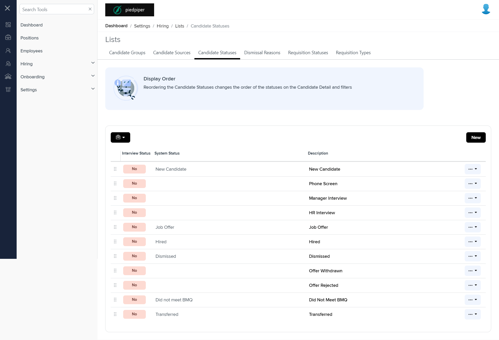

# Summary of `candidate-statuses.component.html`

## Table of Contents

-   [Relative Path](#relative-path)
-   [Summary](#summary)
-   [Mock Screenshots](#mock-screenshots)
-   [Prod Screenshots](#prod-screenshots)
-   [URL](#url)

### Relative Path

-   **candidate-statuses.component.html**: `AgileHR\Talent\Talent.Web\ClientApp\src\app\settings\hiring\lists\candidate-statuses\candidate-statuses.component.html`

### Summary

-   Contains a `<message-panel>` component with attributes `[title]` set to `'Display Order'` and `[content]` set to `'Reordering the Candidate Statuses changes the order of the statuses on the Candidate Detail and filters'`.
-   Contains a `<talent-grid>` component with various attributes and event bindings such as `[allowFiltering]`, `[allowBulkActions]`, `[allowPaging]`, `[allowRowDragAndDrop]`, `[allowRowSelect]`, `[allowSearch]`, `[allowSorting]`, `[allowNew]`, `[data]`, `[friendlyName]`, `exportFileName`, `[initializing]`, `(selected)`, `[selectActionTooltip]`, `[searchFields]`, and `(rowDrop)`.
-   The `<talent-grid>` contains an `<e-columns>` component with multiple `<e-column>` components.
-   The first `<e-column>` component has attributes `field` set to `"candidateStatus"`, `headerText` set to `"Interview Status"`, `width` set to `"100px"`, and `[template]` set to `candidateStatus`.
-   The second `<e-column>` component has attributes `field` set to `"systemStatus"` and `headerText` set to `"System Status"`.
-   The third `<e-column>` component has attributes `field` set to `"description"` and `headerText` set to `"Description"`.
-   The third `<e-column>` component contains an `<ng-template>` with a `*hasKey` directive and a `#template` identifier.
-   The `<ng-template>` contains an `<ejs-tooltip>` component with a `[content]` attribute.
-   Inside the `<ejs-tooltip>`, there is an `<a>` element with a `class` attribute set to `'grid-link disable-row-select'` and a `(click)` event bound to the `onLinkClicked($event, data)` method.
-   The fourth `<e-column>` component has attributes `field` set to an empty string, `textAlign` set to `"center"`, `[template]` set to `dropdownactionbutton`, and `width` set to `"80px"`.
-   Contains an `<ng-template>` with `#candidateStatus` and a `let-data` directive.
-   The `<ng-template>` contains a `
` element with the class `btn-width` and an `[ngClass]` attribute bound to `'status__' + removeWhiteSpace(data.candidateStatus)`.
-   Inside the `
`, there is a text interpolation for `data.candidateStatus`.
-   Contains an `<ng-template>` with `#dropdownactionbutton` and a `let-data` directive.
-   The `<ng-template>` contains a `<button-dropdown-grid>` component with attributes `[items]`, `[tooltip]`, and `(onSelect)`.
-   The `[items]` attribute is bound to `!data.systemId ? editDeleteSelectOptions : editSelectOptions`.
-   The `[tooltip]` attribute is bound to `selectActionTooltip`.
-   The `(onSelect)` event is bound to the `selected($event, data)` method.
-   Contains a `<modal-base>` component with `[config]` and `[template]` attributes for `createEditCandidateStatusModal` and `newTypeContent`, respectively.
-   Contains an `<ng-template>` with `#newTypeContent` and a `[formGroup]` attribute bound to `candidateStatusForm`.
-   The `<ng-template>` contains a `<message-panel>` component with attributes `[title]` set to `'ATTENTION'`, `[state]` set to `1`, and `*ngIf` directive.
-   The `<message-panel>` contains a `
` element with a confirmation message.
-   The `<ng-template>` also contains a `<settings-table>` component with nested `<settings-row>` components.
-   The first `<settings-row>` component has attributes `[title]` set to `'Description'`, `[description]` set to an empty string, and `[required]` set to `true`.
-   Inside the first `<settings-row>`, there is an `<input-text>` component with attributes `[form]`, `formControlName`, and `[placeholder]`.
-   The second `<settings-row>` component has attributes `*ngIf` directive and `[title]` set to `'Interview Status'`.
-   Inside the second `<settings-row>`, there is a `<toggle-switch>` component with attributes `(check)`, `[form]`, `formControlName`, and `floatLabelType`.
-   Contains another `<modal-base>` component with `[config]` and `[template]` attributes for `deleteCandidateStatusModal` and `deleteContent`, respectively.
-   Contains an `<ng-template>` with `#deleteContent`.
-   The `<ng-template>` contains a `
` element with the class `row`.
-   Inside the `
`, there is another `
` element with the class `col-xs-12` containing a confirmation message for deleting a candidate status record.
-   Contains another `<modal-base>` component with `[config]` and `[template]` attributes for `unsavedChangesModal` and `unsavedChangesContent`, respectively.
-   Contains an `<ng-template>` with `#unsavedChangesContent`.
-   The `<ng-template>` contains a `
` element with the class `row`.
-   Inside the `
`, there is another `
` element with the class `col-xs-12` containing a confirmation message for unsaved changes.

### This component is currently not implemented in mock environment.

### Mock Screenshots

N/A

### Prod Screenshots

### URL

[link to the page in prod](https://piedpiper.agilehr.net/core/settings/hiring/lists/candidate-statuses)
