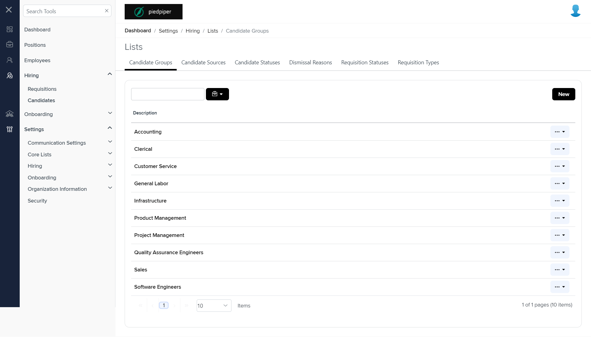

# Summary of `lists.component.html`

## Table of Contents

-   [Relative Path](#relative-path)
-   [Summary](#summary)
-   [Mock Screenshots](#mock-screenshots)
-   [Prod Screenshots](#prod-screenshots)
-   [URL](#url)

### Relative Path

-   **lists.component.html**: `AgileHR\Talent\Talent.Web\ClientApp\src\app\settings\hiring\lists\lists.component.html`

### Summary

-   Contains a `<navigation-tab>` component.
-   Contains a `<router-outlet>` component.

### This component is currently not implemented in mock environment.

### Mock Screenshots

N/A

### Prod Screenshots

### URL

[link to the page in prod](https://piedpiper.agilehr.net/core/settings/hiring/lists/candidate-groups)
