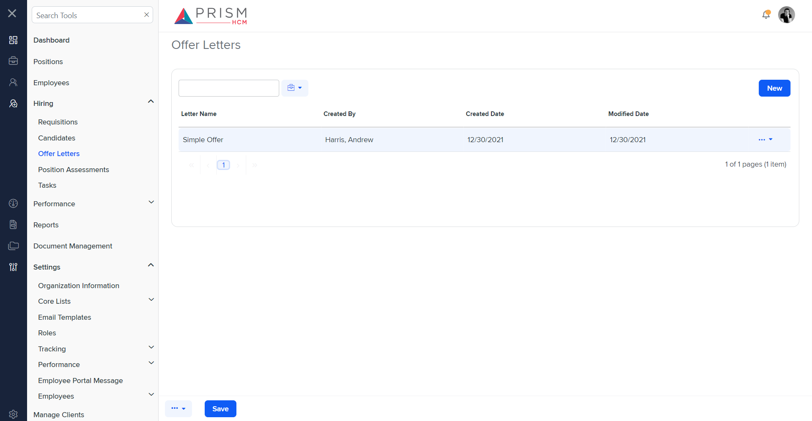
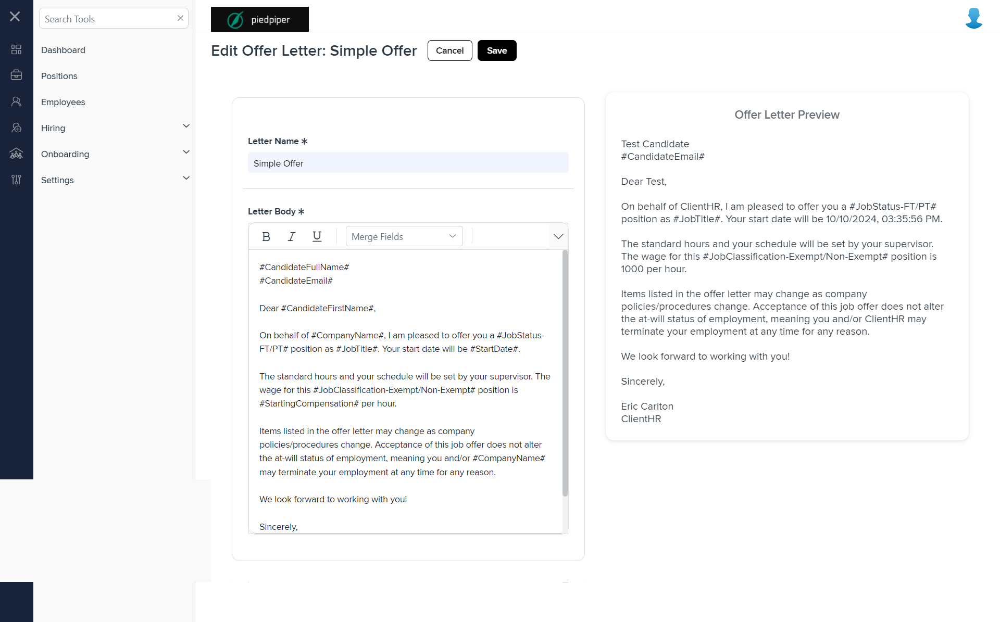

# Differences between `new-edit-offer-letter.component.html` and `h-ot.component.html`

## Table of Contents

-   [Relative Paths](#relative-paths)
-   [Differences](#differences)
-   [Mock Screenshots](#mock-screenshots)
-   [Prod Screenshots](#prod-screenshots)
-   [URL](#url)

### Relative Paths

-   **new-edit-offer-letter.component.html**: `AgileHR\Talent\Talent.Web\ClientApp\src\app\settings\hiring\offer-letters\new-edit-offer-letter\new-edit-offer-letter.component.html`
-   **h-ot.component.html**: `components-ng-shared\projects\mocks-talent-ng\src\app\hiring\h-ot\h-ot.component.html`

### Differences

#### AgileHR\Talent\Talent.Web\ClientApp\src\app\settings\hiring\offer-letters\new-edit-offer-letter\new-edit-offer-letter.component.html

-   Contains a `
` with class `modal-drawer__head` and a nested `{{ offerLetterHeading }}`.
-   Contains a `
` with class `modal-drawer__cta` and nested `<button-base>` components for 'Cancel' and 'Save'.
-   Contains a `
` with class `card card--split`.
-   Contains a `
` with class `split__col` and a nested `<fieldset>` with `[formGroup]` bound to `offerLetterForm` and `[disabled]` bound to `!isEditable`.
-   The `<fieldset>` contains a `<settings-table>` component with nested `<settings-row>` components.
-   The first `<settings-row>` component has attributes `[title]` set to `'Letter Name'`, `[description]` set to an empty string, and `[required]` set to `true`.
-   Inside the first `<settings-row>`, there is an `<input-text>` component with attributes `[placeholder]` set to `'Letter Name'`, `[required]` set to `true`, `[form]` bound to `offerLetterForm`, and `formControlName` set to `"letterName"`.
-   The second `<settings-row>` component has attributes `[title]` set to `'Letter Body'`, `[description]` set to an empty string, `[required]` set to `true`, and `[type]` set to `'WYSIWYG'`.
-   Inside the second `<settings-row>`, there is an `<input-rich-text>` component with attributes `[height]` set to `480`, `(created)` bound to `onCreate()`, `[form]` bound to `offerLetterForm`, `formControlName` set to `"letterContent"`, and `[toolbarSettings]` bound to `editorTools`.
-   Contains a `
` element with class `error-message` and `*ngIf` directive bound to `showLetterContentError`.
-   The `
` element contains a nested `` element with `[innerText]` set to `'This field is required'`.
-   Contains a `
` with class `split__col offer-letter`.
-   The `
` contains a nested `
` with class `offer-letter__title` and inline style `align-self: center;` with the text `Offer Letter Preview`.
-   Contains a nested `
` with class `offer-letter__body` and a nested `
` with class `offer-letter__message`.
-   The `
` contains a nested `
` with class `disabled` and `[innerHTML]` bound to `previewHtml`.

#### components-ng-shared\projects\mocks-talent-ng\src\app\hiring\h-ot\h-ot.component.html

-   Contains a `<page-title>` component with a `[title]` attribute set to `'Offer Letters'`.
-   Contains a `<grid-filters>` component with attributes `[centerTemplate]` and `[centerHeaderTemplate]`.
-   Contains an `<ng-template>` with `#centerHeaderTemplate` and a nested `
` with class `custom-toolbar`.
-   The `
` contains a nested `
` with class `custom-toolbar__wrapper`.
-   The `
` contains a nested `
` with class `custom-toolbar__lc` and a nested `<input-text>` component with attributes `[placeholder]` set to `'Search'` and `[cssClass]` set to `'search-bar'`.
-   Contains a nested `<button-dropdown-grid>` component with attributes `[items]` bound to `toolbarbtns`, `tooltip` set to `'Table tools'`, `[callback]` bound to `select`, and `[icon]` set to `'prism-icons-toolbox'`.
-   Contains a nested `
` with class `custom-toolbar__rc` and a nested `<button-new>` component with attributes `(click)` bound to `newOfferLetter()`, `[tooltip]` set to `'Add a new Offer Letter'`, `onKeyPress`, `onKeyDown`, and `onKeyUp`.
-   Contains an `<ng-template>` with `#centerContent` and a nested `<ejs-grid>` component with attributes `[enableAdaptiveUI]` set to `true`, `[rowRenderingMode]` set to `'Vertical'`, `[allowPaging]` set to `true`, `[dataSource]` bound to `appraisalData`, and `(toolbarClick)` bound to `clickHandler($event)`.
-   The `<ejs-grid>` contains an `<e-columns>` component with multiple `<e-column>` components.
-   The `<e-column>` components have attributes such as `field`, `headerText`, and `width`.
-   Contains an `<ng-template>` with `#editbutton` and a nested `<button-dropdown-grid>` component with attributes `[items]` bound to `items`, `tooltip` set to `'Choose an option'`, and `[callback]` bound to `select`.
-   Contains a `<modal-base>` component with `[config]` bound to `deleteModal` and `[template]` bound to `deleteModalSetup`.
-   Contains an `<ng-template>` with `#deleteModalSetup` and a nested `
` with class `row`.
-   The `
` contains a nested `
` with class `col-xs-12` and a confirmation message for deleting an offer letter.
-   Contains multiple `<ng-template>` elements with `#evealuateStatus`, `#itemStatus`, and `#searchbar`.
-   Contains a `<modal-base>` component with `[config]` bound to `newOLModal` and `[template]` bound to `newUserContent`.
-   Contains an `<ng-template>` with `#newUserContent` and a nested `<settings-table>` component with multiple `<settings-row>` components.
-   The `<settings-row>` components have attributes such as `[title]`, `[required]`, and `[description]`.
-   The `<settings-row>` components contain various input components such as `<input-text>`, `<input-dropdown>`, and `<input-rich-text>`.

### Mock Screenshots

### Prod Screenshots

### URL

[link to the page in mock environment](http://localhost:4340/hiring/h-ot)

[link to the page in prod](https://piedpiper.agilehr.net/core/settings/hiring/offer-letters)
