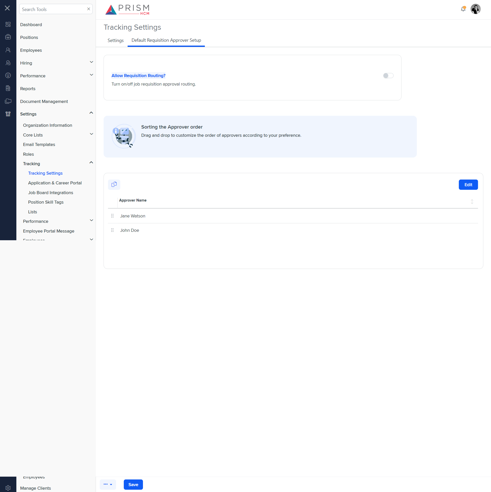

# Differences between `approver-setup.component.html` and `track-sett.component.html`

## Table of Contents

-   [Relative Paths](#relative-paths)
-   [Differences](#differences)
-   [Prod Screenshots](#prod-screenshots)
-   [Mock Screenshots](#mock-screenshots)
-   [URL](#url)

### Relative Paths

-   **approver-setup.component.html**: `AgileHR\Talent\Talent.Web\ClientApp\src\app\settings\hiring\settings\approver-setup\approver-setup.component.html`
-   **track-sett.component.html**: `components-ng-shared\projects\mocks-talent-ng\src\app\settings\tracking\track-sett\track-sett.component.html`

### Differences

#### path/to/approver-setup.component.html

-   Contains a `<talent-footer>` component with attributes `[nextVisible]`, `[prevVisible]`, `(saveClicked)`, `[saveEnabled]`, and `[saveVisible]`.
-   Contains a `<ng-container>` element with a `[formGroup]` attribute bound to `hiringSettingForm`.
-   The `<ng-container>` contains a `<settings-table>` component with a nested `<settings-row>` component.
-   The `<settings-row>` component has attributes `[title]`, `[description]`, and `[required]`.
-   Inside the `<settings-row>`, there is a `<toggle-switch>` component with attributes `[form]` and `formControlName`.
-   Contains a `
` element with an `*ngIf` directive bound to `hiringSettingForm.get('requisitionApproval').value`.
-   The `
` contains a `<talent-grid>` component with various attributes and event bindings such as `[allowNew]`, `[allowFiltering]`, `[allowBulkActions]`, `[allowPaging]`, `[allowRowDragAndDrop]`, `[allowSearch]`, `[allowRowSelect]`, `[allowSorting]`, `[allowAdditionalAction]`, `[additionalActionTitle]`, `[additionalActionTooltip]`, `[data]`, `exportFileName`, `friendlyName`, `[initializing]`, `(selected)`, `[selectActionTooltip]`, `[selectOptions]`, and `(rowDrop)`.
-   The `<talent-grid>` contains an `<e-columns>` component with a single `<e-column>` component.
-   The `<e-column>` component has attributes `field` and `headerText`.
-   Contains a `<modal-base>` component with `[config]` and `[template]` attributes for `confirmationPopupConfig` and `deleteContent`, respectively.
-   Contains an `<ng-template>` with `#deleteContent` and a nested `
` element with the class `row`.
-   The `
` contains a nested `
` element with the class `col-xs-12` and a confirmation message.
-   Contains another `<modal-base>` component with `[config]` and `[template]` attributes for `newSetupModal` and `editSetupContent`, respectively.
-   Contains an `<ng-template>` with `#editSetupContent` and a nested `<ng-container>` element with a `[formGroup]` attribute bound to `approverFormGroup`.
-   The `<ng-container>` contains a `<settings-table>` component with a nested `<settings-row>` component.
-   The `<settings-row>` component has attributes `[title]`, `[description]`, and `[required]`.
-   Inside the `<settings-row>`, there is an `<input-dropdown-multi>` component with attributes `[form]`, `formControlName`, `[data]`, `[mode]`, `ngDefaultControl`, and `[required]`.

#### components-ng-shared\projects\mocks-talent-ng\src\app\settings\tracking\track-sett\track-sett.component.html

-   Contains a `<page-title>` component with a `[title]` attribute set to `'Tracking Settings'`.
-   Contains an `<ejs-tab>` component with `id="tab_default"` and `heightAdjustMode="Auto"`.
-   The `<ejs-tab>` contains an `<e-tabitems>` component with multiple `<e-tabitem>` components.
-   Each `<e-tabitem>` component has a `[header]` attribute and a nested `<ng-template>` with various `<settings-table>` and `<settings-row>` components.
-   The `<settings-row>` components have attributes such as `[title]`, `[description]`, and `[required]`.
-   The `<settings-row>` components contain various input components such as `<toggle-switch>` and `<input-text>`.
-   Contains a `<message-panel>` component with attributes `[title]` and `[content]`.
-   Contains a `<grid-filters>` component with attributes `[centerTemplate]` and `[centerHeaderTemplate]`.
-   Contains an `<ng-template>` with `#centerHeaderTemplate` and a nested `
` with class `custom-toolbar`.
-   The `
` contains nested `
` elements with classes `custom-toolbar__wrapper`, `custom-toolbar__lc`, and `custom-toolbar__rc`.
-   The `
` contains nested `<button-base>` components with attributes `[tooltip]`, `[class]`, `[iconClass]`, `(click)`, `onKeyPress`, `onKeyDown`, and `onKeyUp`.
-   Contains an `<ng-template>` with `#centerContent` and a nested `<ejs-grid>` component with attributes `[enableAdaptiveUI]`, `[rowRenderingMode]`, `[dataSource]`, `[allowSorting]`, and `[allowRowDragAndDrop]`.
-   The `<ejs-grid>` contains an `<e-columns>` component with a single `<e-column>` component.
-   The `<e-column>` component has attributes `field` and `headerText`.
-   Contains a `<modal-base>` component with `[config]` and `[template]` attributes for `editModal` and `editSetupContent`, respectively.
-   Contains an `<ng-template>` with `#editSetupContent` and a nested `<settings-table>` component with multiple `<settings-row>` components.
-   The `<settings-row>` components have attributes `[title]` and `[description]`.
-   The `<settings-row>` components contain various input components such as `<input-dropdown>` and `<input-dropdown-multi>`.

### This component is currently not implemented in production.

### Prod Screenshots

N/A

### Mock Screenshots

### URL

[link to the page in mock environment](http://localhost:4340/settings/tracking/tacking-settings)
