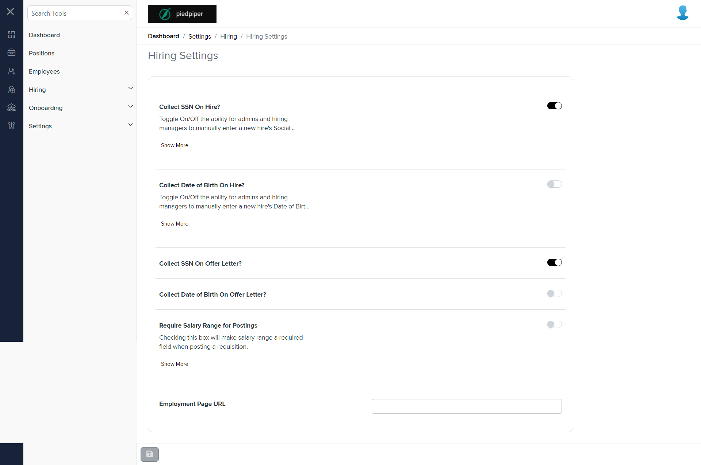
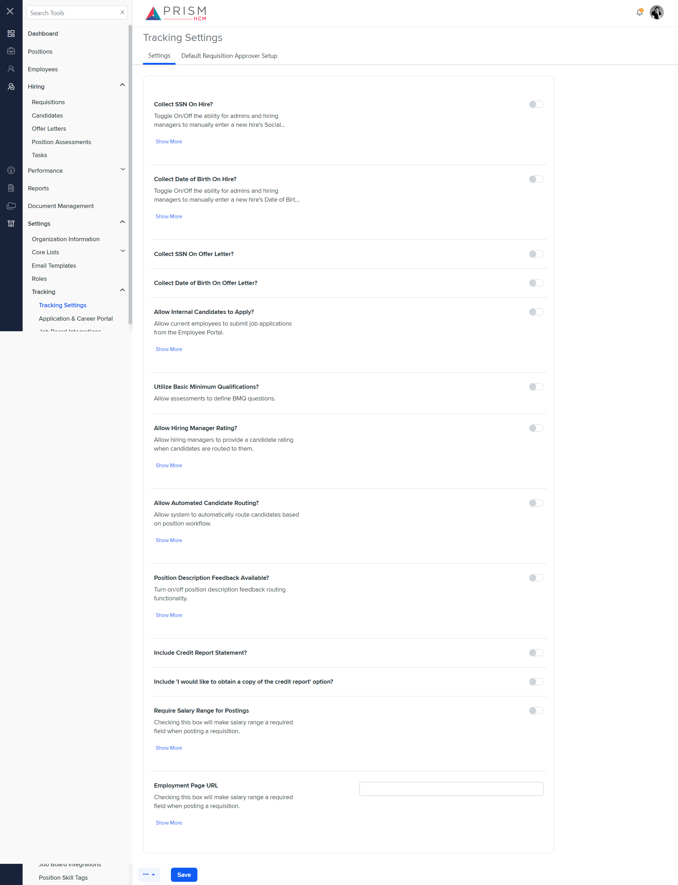

# Differences between `general-settings.component.html` and `track-sett.component.html`

## Table of Contents

-   [Relative Paths](#relative-paths)
-   [Differences](#differences)
-   [Prod Screenshots](#prod-screenshots)
-   [Mock Screenshots](#mock-screenshots)
-   [URL](#url)

### Relative Paths

-   **general-settings.component.html**: `AgileHR\Talent\Talent.Web\ClientApp\src\app\settings\hiring\settings\general-settings\general-settings.component.html`
-   **track-sett.component.html**: `components-ng-shared\projects\mocks-talent-ng\src\app\settings\tracking\track-sett\track-sett.component.html`

### Differences

#### AgileHR\Talent\Talent.Web\ClientApp\src\app\settings\hiring\settings\general-settings\general-settings.component.html

-   Contains a `<talent-footer>` component with attributes `[nextVisible]`, `[prevVisible]`, `(saveClicked)`, `[saveEnabled]`, and `[saveVisible]`.
-   Contains a `<fieldset>` element with a `[formGroup]` attribute bound to `hiringSettingForm` and `[disabled]` bound to `!isEditable`.
-   The `<fieldset>` contains a `<settings-table>` component with multiple `<settings-row>` components.
-   The `<settings-row>` components have attributes `[title]`, `[description]`, and `[required]`.
-   The `<settings-row>` components contain `<toggle-switch>` components with attributes `[form]`, `formControlName`, and `[enabled]`.
-   Contains a `<settings-row>` component with `[title]` set to `'Employment Page URL'` and a nested `<input-text>` component with attributes `[placeholder]`, `[form]`, and `formControlName`.

#### components-ng-shared\projects\mocks-talent-ng\src\app\settings\tracking\track-sett\track-sett.component.html

-   Contains a `<page-title>` component with a `[title]` attribute set to `'Tracking Settings'`.
-   Contains an `<ejs-tab>` component with `id="tab_default"` and `heightAdjustMode="Auto"`.
-   The `<ejs-tab>` contains an `<e-tabitems>` component with multiple `<e-tabitem>` components.
-   Each `<e-tabitem>` component has a `[header]` attribute and a nested `<ng-template>` with various `<settings-table>` and `<settings-row>` components.
-   The `<settings-row>` components have attributes `[title]`, `[description]`, and `[required]`.
-   The `<settings-row>` components contain `<toggle-switch>` components.
-   Contains a `<settings-row>` component with `[title]` set to `'Employment Page URL'` and a nested `<input-text>` component with a `[placeholder]` attribute.
-   Contains a `<settings-row>` component with `[title]` set to `'Allow Requisition Routing?'` and a nested `<toggle-switch>` component.
-   Contains a `<message-panel>` component with attributes `[title]` and `[content]`.
-   Contains a `<grid-filters>` component with attributes `[centerTemplate]` and `[centerHeaderTemplate]`.
-   Contains an `<ng-template>` with `#centerHeaderTemplate` and a nested `
` with class `custom-toolbar`.
-   The `
` contains nested `
` elements with classes `custom-toolbar__wrapper`, `custom-toolbar__lc`, and `custom-toolbar__rc`.
-   The `
` contains nested `<button-base>` components with attributes `[tooltip]`, `[class]`, `[iconClass]`, `(click)`, `onKeyPress`, `onKeyDown`, and `onKeyUp`.
-   Contains an `<ng-template>` with `#centerContent` and a nested `<ejs-grid>` component with attributes `[enableAdaptiveUI]`, `[rowRenderingMode]`, `[dataSource]`, `[allowSorting]`, and `[allowRowDragAndDrop]`.
-   The `<ejs-grid>` contains an `<e-columns>` component with a single `<e-column>` component.
-   The `<e-column>` component has attributes `field` and `headerText`.
-   Contains a `<modal-base>` component with `[config]` and `[template]` attributes for `editModal` and `editSetupContent`, respectively.
-   Contains an `<ng-template>` with `#editSetupContent` and a nested `<settings-table>` component with multiple `<settings-row>` components.
-   The `<settings-row>` components have attributes `[title]` and `[description]`.
-   The `<settings-row>` components contain various input components such as `<input-dropdown>` and `<input-dropdown-multi>`.

### Prod Screenshots

### Mock Screenshots

### URL

[link to the page in prod](https://piedpiper.agilehr.net/core/settings/hiring/settings)

[link to the page in mock environment](http://localhost:4340/settings/tracking/tacking-settings)
