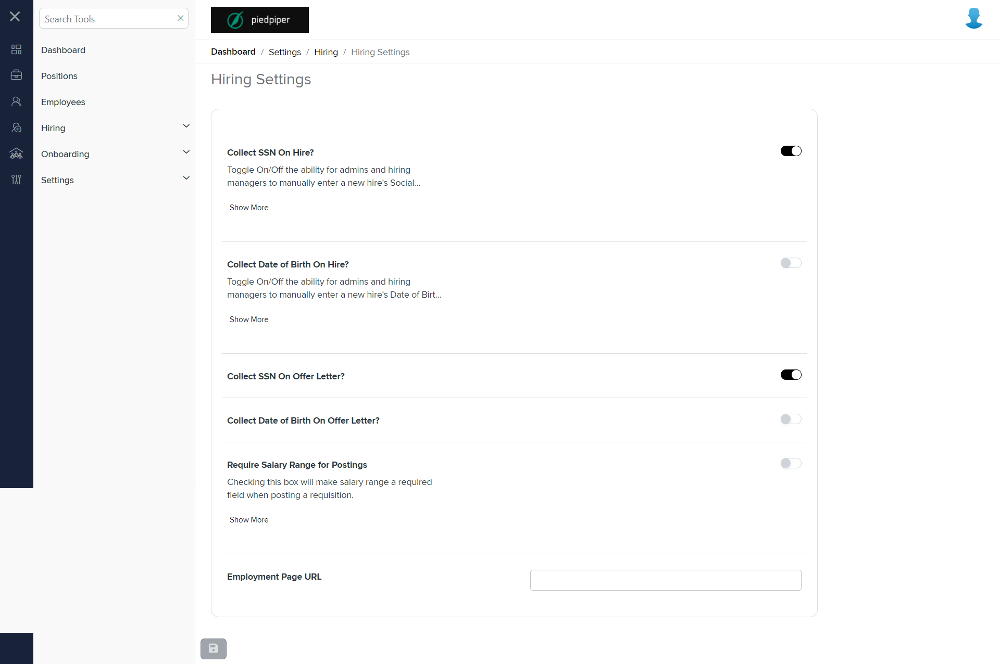

# Summary of `settings.component.html`

## Table of Contents

-   [Relative Path](#relative-path)
-   [Summary](#summary)
-   [Prod Screenshots](#prod-screenshots)
-   [Mock Screenshots](#mock-screenshots)
-   [URL](#url)

### Relative Path

-   **settings.component.html**: `AgileHR\Talent\Talent.Web\ClientApp\src\app\settings\hiring\settings\settings.component.html`

### Summary

-   Contains a `<page-title>` component with a `[title]` attribute set to `'Hiring Settings'`.
-   Contains an `<app-sts-general-settings>` component with an `[activeTabIndex]` attribute.
-   Contains a commented-out `<ejs-tab>` component with `id="adaptiveTab"` and `overflowMode="Popup"`.
-   The commented-out `<ejs-tab>` contains an `<e-tabitems>` component with two `<e-tabitem>` components.
-   The first `<e-tabitem>` has a `[header]` attribute and a nested `<ng-template>` with an `<app-sts-general-settings>` component.
-   The second `<e-tabitem>` has a `[header]` attribute and a nested `<ng-template>` with an `<app-sts-approver-setup>` component.

### This component is currently not implemented in mock environment.

### Prod Screenshots

### Mock Screenshots

N/A

### URL

[link to the page in prod](https://piedpiper.agilehr.net/core/settings/hiring/settings)
