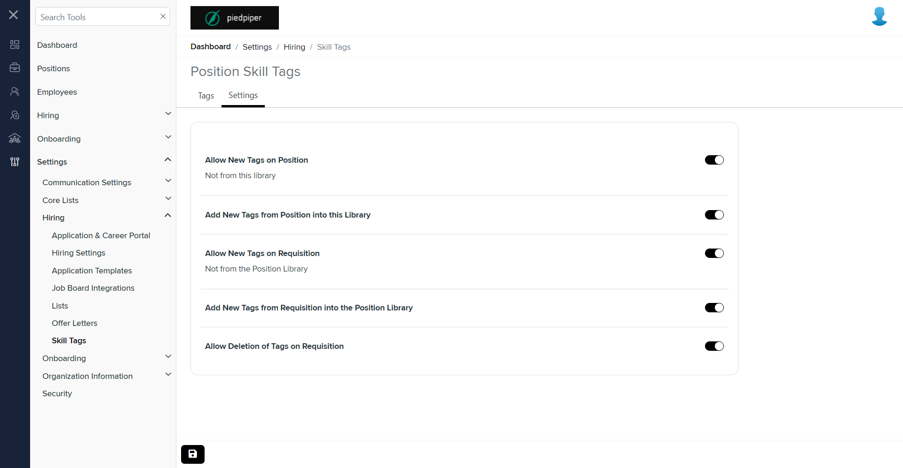
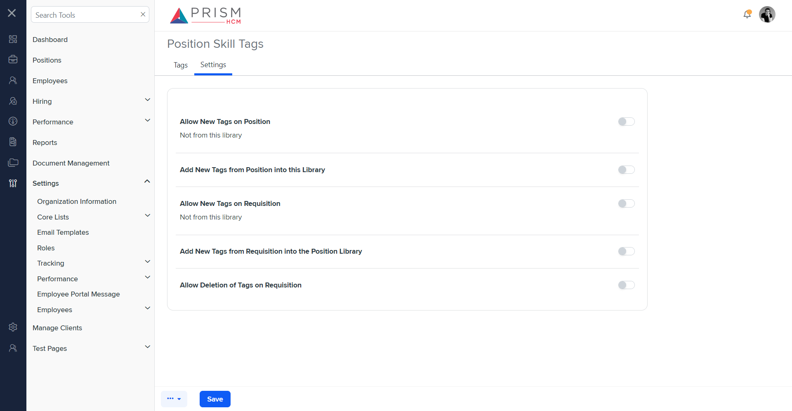

# Differences between `settings.component.html` and `sps-settings.component.html`

## Table of Contents

-   [Relative Paths](#relative-paths)
-   [Differences](#differences)
-   [Prod Screenshots](#prod-screenshots)
-   [Mock Screenshots](#mock-screenshots)
-   [URL](#url)

### Relative Paths

-   **settings.component.html**: `AgileHR\Talent\Talent.Web\ClientApp\src\app\settings\hiring\skill-tags\settings\settings.component.html`
-   **sps-settings.component.html**: `components-ng-shared\projects\mocks-talent-ng\src\app\settings\tracking\track-pst\sps-settings\sps-settings.component.html`

### Differences

#### AgileHR\Talent\Talent.Web\ClientApp\src\app\settings\hiring\skill-tags\settings\settings.component.html

-   Contains a `<talent-footer>` component with attributes `[nextVisible]`, `[prevVisible]`, `(saveClicked)`, `[saveEnabled]`, and `[saveVisible]`.
-   Contains a `<fieldset>` element with a `[formGroup]` attribute bound to `tagSettingForm`.
-   The `<fieldset>` contains a `<settings-table>` component with multiple `<settings-row>` components.
-   The `<settings-row>` components have attributes `[title]`, `[description]`, and `[required]`.
-   The `<settings-row>` components contain `<toggle-switch>` components with attributes `[form]`, `formControlName`, and `[enabled]`.

#### components-ng-shared\projects\mocks-talent-ng\src\app\settings\tracking\track-pst\sps-settings\sps-settings.component.html

-   Contains a `<settings-table>` component with multiple `<settings-row>` components.
-   The `<settings-row>` components have attributes `[title]`, `[description]`, and `[required]`.
-   The `<settings-row>` components contain `<toggle-switch>` components without additional attributes.

### Prod Screenshots

### Mock Screenshots

### URL

[link to the page in prod](https://piedpiper.agilehr.net/core/settings/hiring/skill-tags)

[link to the page in mock environment](http://localhost:4340/settings/tracking/position-skill-tags)
