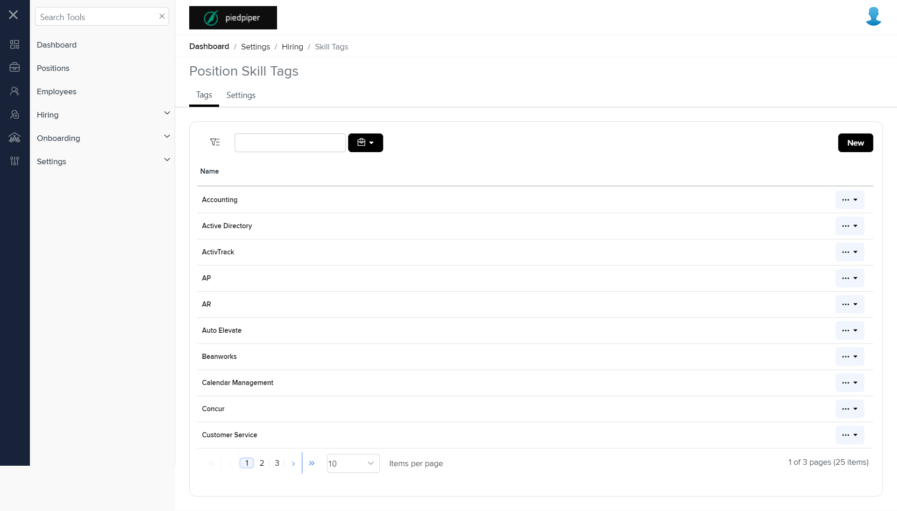
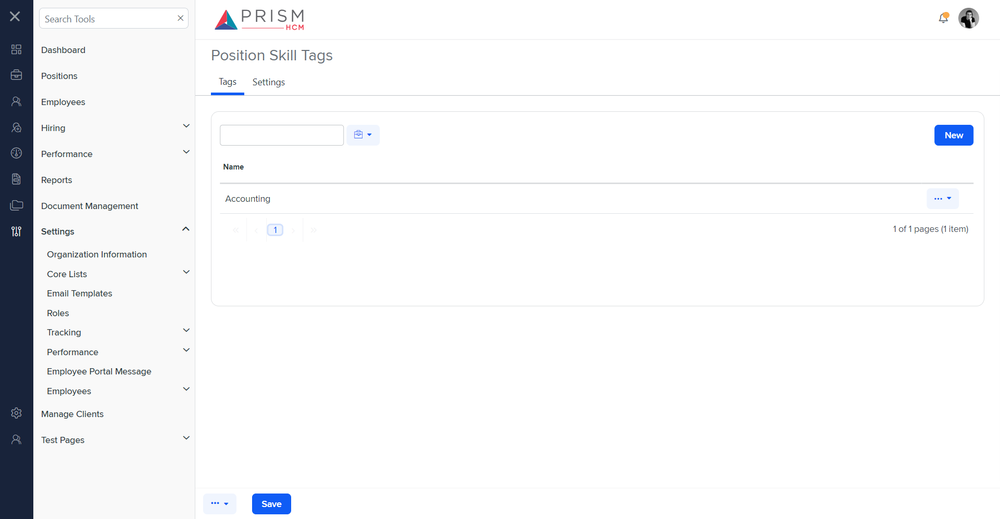

# Differences between `skill-tags.component.html` and `track-pst.component.html`

## Table of Contents

-   [Relative Paths](#relative-paths)
-   [Differences](#differences)
-   [Prod Screenshots](#prod-screenshots)
-   [Mock Screenshots](#mock-screenshots)
-   [URL](#url)

### Relative Paths

-   **track-pst.component.html**: `components-ng-shared\projects\mocks-talent-ng\src\app\settings\tracking\track-pst\track-pst.component.html`
-   **skill-tags.component.html**: `AgileHR\Talent\Talent.Web\ClientApp\src\app\settings\hiring\skill-tags\skill-tags.component.html`

### Differences

#### components-ng-shared\projects\mocks-talent-ng\src\app\settings\tracking\track-pst\track-pst.component.html

-   Contains a `<page-title>` component with a `[title]` attribute set to `'Position Skill Tags'`.
-   Contains an `<ejs-tab>` component with `id="adaptiveTab"`, `overflowMode="Popup"`, and `(selected)` event bound to `selected($event)`.
-   The `<ejs-tab>` contains an `<e-tabitems>` component with two `<e-tabitem>` components.
-   The first `<e-tabitem>` has a `[header]` attribute bound to `headerText[0]` and a nested `<ng-template>` with an `<app-tags>` component.
-   The second `<e-tabitem>` has a `[header]` attribute bound to `headerText[1]` and a nested `<ng-template>` with an `<app-settings>` component.

#### AgileHR\Talent\Talent.Web\ClientApp\src\app\settings\hiring\skill-tags\skill-tags.component.html

-   Contains a `<page-title>` component with a `[title]` attribute set to `'Position Skill Tags'`.
-   Contains an `<ejs-tab>` component with `id="adaptiveTab"` and `overflowMode="Popup"`.
-   The `<ejs-tab>` contains an `<e-tabitems>` component with two `<e-tabitem>` components.
-   The first `<e-tabitem>` has a `[header]` attribute bound to `headerText[0]` and a nested `<ng-template>` with an `<app-sps-tags>` component.
-   The second `<e-tabitem>` has a `[header]` attribute bound to `headerText[1]` and a nested `<ng-template>` with an `<app-sps-settings>` component.

### Prod Screenshots

### Mock Screenshots

### URL

[link to the page in prod](https://piedpiper.agilehr.net/core/settings/hiring/skill-tags)

[link to the page in mock environment](http://localhost:4340/settings/tracking/position-skill-tags)
