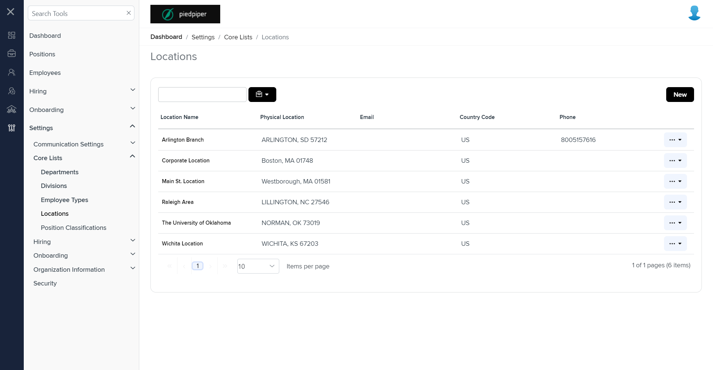
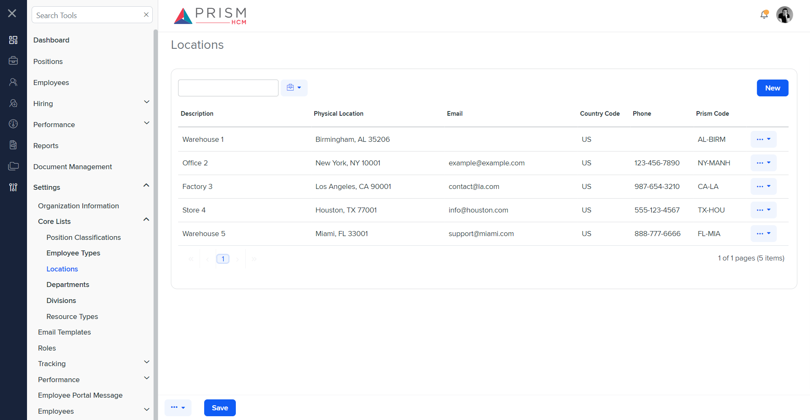

# Differences between `locations.component.html` and `scl-locs.component.html`

## Table of Contents

-   [Relative Paths](#relative-paths)
-   [Differences](#differences)
-   [Prod Screenshots](#prod-screenshots)
-   [Mock Screenshots](#mock-screenshots)
-   [URL](#url)

### Relative Paths

-   **locations.component.html**: `AgileHR\Talent\Talent.Web\ClientApp\src\app\settings\lists\locations\locations.component.html`
-   **scl-locs.component.html**: `components-ng-shared\projects\mocks-talent-ng\src\app\settings\s-core-lists\scl-locs\scl-locs.component.html`

### Differences

#### components-ng-shared\projects\mocks-talent-ng\src\app\settings\s-core-lists\scl-locs\scl-locs.component.html

-   Contains a `<talent-loading>` component with a `[loading]` attribute bound to `loading`.
-   Contains a `<talent-grid>` component with various attributes such as `[allowBulkActions]`, `[allowFiltering]`, `[allowNew]`, `[allowRowSelect]`, `[data]`, `exportFileName`, `friendlyName`, `idProperty`, `[initializing]`, `[searchFields]`, `(selected)`, and `[selectOptions]`.
-   The `<talent-grid>` contains an `<e-columns>` component with multiple `<e-column>` components.
-   The first `<e-column>` component has an `*ngIf` directive bound to `isHcmSync`, `field`, `headerText`, and `width`.
-   The first `<e-column>` component contains an `<ng-template>` with `#template` and `let-data`.
-   The `<ng-template>` contains an `<ejs-tooltip>` component with an `*ngIf` directive bound to `data.locationCode`, `#tooltip`, and `content`.
-   The `<ejs-tooltip>` contains an `<i>` element with class `status__base status__small-block fa-regular fa-rotate`.
-   The second `<e-column>` component has attributes `field` and `headerText`.
-   The second `<e-column>` component contains an `<ng-template>` with `*hasKey`, `#template`, and `let-data`.
-   The `<ng-template>` contains an `<ejs-tooltip>` component with `#tooltip` and `[content]`.
-   The `<ejs-tooltip>` contains an `<a>` element with class `grid-link disable-row-select` and a `(click)` event.
-   The third `<e-column>` component has attributes `field`, `headerText`, and `*hasPayrollIntegration`.
-   Contains a `<modal-base>` component with `[config]` and `[template]` attributes for `deleteModal` and `deleteContent`, respectively.
-   Contains an `<ng-template>` with `#deleteContent` and a nested `
` element with the class `row`.
-   The `
` contains a nested `
` element with the class `col-xs-12` and a confirmation message.
-   Contains another `<modal-base>` component with `[config]` and `[template]` attributes for `editSetupModal` and `editSetupContent`, respectively.
-   Contains an `<ng-template>` with `#editSetupContent` and a nested `<ng-container>` element with a `[formGroup]` attribute bound to `locationFormGroup`.
-   The `<ng-container>` contains a `<settings-table>` component with multiple `<settings-row>` components.
-   The first `<settings-row>` component has attributes `[title]`, `[description]`, and `[required]`.
-   The first `<settings-row>` component contains an `<input-text>` component with attributes `[placeholder]`, `[required]`, `[form]`, and `formControlName`.
-   The second `<settings-row>` component has attributes `[title]`, `[description]`, and `[required]`.
-   The second `<settings-row>` component contains an `<input-dropdown>` component with attributes `[form]`, `formControlName`, `[data]`, `placeholder`, `[enableFiltering]`, `[enable]`, `[floatLabelType]`, and `[validation]`.
-   The third `<settings-row>` component has attributes `[title]`, `[description]`, and `[required]`.
-   The third `<settings-row>` component contains an `<input-text>` component with attributes `[placeholder]`, `[required]`, `[form]`, and `formControlName`.
-   The fourth `<settings-row>` component has attributes `[title]`, `[description]`, and `[required]`.
-   The fourth `<settings-row>` component contains an `<input-dropdown>` component with attributes `[form]`, `formControlName`, `[data]`, `placeholder`, `[enableFiltering]`, `[enabled]`, `[floatLabelType]`, and `[required]`.
-   The fifth `<settings-row>` component has attributes `[title]`, `[description]`, and `[required]`.
-   The fifth `<settings-row>` component contains an `<ejs-maskedtextbox>` component with attributes `form`, `formControlName`, `mask`, `placeholder`, `floatLabelType`, and `required`.
-   The fifth `<settings-row>` component contains a `
` element with an `*ngIf` directive bound to `locationFormGroup.controls.maskedZipCode.invalid && locationFormGroup.controls.maskedZipCode.touched` and class `error-message masked-value-error-message`.
-   The sixth `<settings-row>` component has attributes `[title]`, `[description]`.
-   The sixth `<settings-row>` component contains an `<input-text>` component with attributes `[placeholder]`, `[form]`, and `formControlName`.
-   The seventh `<settings-row>` component has attributes `[title]`, `[description]`.
-   The seventh `<settings-row>` component contains an `<input-phone>` component with attributes `[placeholder]`, `[mask]`, `[form]`, and `formControlName`.
-   The eighth `<settings-row>` component has attributes `[title]`, `[description]`.
-   The eighth `<settings-row>` component contains an `<input-text>` component with attributes `[placeholder]`.
-   Contains another `<modal-base>` component with `[config]` and `[template]` attributes for `mergeModal` and `mergeContent`, respectively.
-   Contains an `<ng-template>` with `#mergeContent` and a nested `<settings-table>` component with a `[formGroup]` attribute bound to `mergeRequest`.
-   The `<settings-table>` contains multiple `<settings-row>` components.
-   The first `<settings-row>` component has attributes `[title]`, `[description]`, and `[required]`.
-   The first `<settings-row>` component contains an `<input>` element with `value`, `class`, and `disabled`.
-   The second `<settings-row>` component has attributes `[title]`, `[description]`, and `[required]`.
-   The second `<settings-row>` component contains an `<input-dropdown>` component with attributes `[data]`, `placeholder`, `[enableFiltering]`, `[required]`, `[form]`, and `formControlName`.
-   Contains another `<modal-base>` component with `[config]` and `[template]` attributes for `mergeWarningModal` and `mergeWarning`, respectively.
-   Contains an `<ng-template>` with `#mergeWarning` and a nested `<settings-table>` component.
-   The `<settings-table>` contains an `<h1>` element with a confirmation message.

#### path/to/scl-locs.component.html

-   Contains a `<grid-filters>` component with attributes `[centerTemplate]` and `[centerHeaderTemplate]`.
-   The `<grid-filters>` contains an `<ng-template>` with `#centerHeaderTemplate` and a nested `
` element with class `custom-toolbar`.
-   The `
` contains nested `
` elements with classes `custom-toolbar__wrapper`, `custom-toolbar__lc`, and `custom-toolbar__rc`.
-   The `
` contains an `<input-text>` component with attributes `[placeholder]` and `[cssClass]`.
-   The `
` contains a `<button-dropdown-grid>` component with attributes `[items]`, `tooltip`, and `[icon]`.
-   The `
` contains a `<button-base>` component with attributes `[title]`, `[callback]`, `[tooltip]`, `(click)`, `onKeyPress`, `onKeyDown`, and `onKeyUp`.
-   The `<grid-filters>` contains an `<ng-template>` with `#centerContent` and a nested `<ejs-grid>` component with attributes `[enableAdaptiveUI]`, `[rowRenderingMode]`, `[allowPaging]`, and `[dataSource]`.
-   The `<ejs-grid>` contains an `<e-columns>` component with multiple `<e-column>` components.
-   The first `<e-column>` component has attributes `field` and `headerText`.
-   The second `<e-column>` component has attributes `field`, `headerText`, and `width`.
-   The third `<e-column>` component has attributes `field`, `textAlign`, `[template]`, and `width`.
-   Contains an `<ng-template>` with `#editbutton` and a nested `<button-dropdown-grid>` component with attributes `[items]`, `tooltip`, and `[callback]`.
-   Contains multiple `<ng-template>` elements with `#printBtn`, `#pdfBtn`, `#csvBtn`, `#excelBtn`, `#copyBtn`, and `#advancedSearchBtn`.
-   Each `<ng-template>` contains a nested `<button-base>` component with attributes `[title]`, `[tooltip]`, `[isPrimary]`, `[class]`, `[iconClass]`, `(click)`, `onKeyPress`, `onKeyDown`, and `onKeyUp`.
-   Contains an `<ng-template>` with `#searchbar` and a nested `<input-text>` component with attributes `[placeholder]` and `[cssClass]`.
-   Contains a `<modal-base>` component with `[config]` and `[template]` attributes for `deleteModal` and `deleteContent`, respectively.
-   Contains an `<ng-template>` with `#deleteContent` and a nested `
` element with the class `row`.
-   The `
` contains a nested `
` element with the class `col-xs-12` and a confirmation message.
-   Contains another `<modal-base>` component with `[config]` and `[template]` attributes for `newTypeModal` and `newTypeContent`, respectively.
-   Contains an `<ng-template>` with `#newTypeContent` and a nested `<settings-table>` component with multiple `<settings-row>` components.
-   The first `<settings-row>` component has attributes `[title]`, `[description]`, and `[required]`.
-   The first `<settings-row>` component contains an `<input-text>` component with attributes `[placeholder]` and `[required]`.
-   The second `<settings-row>` component has attributes `[title]`, `[description]`, and `[required]`.
-   The second `<settings-row>` component contains an `<input-dropdown>` component with attributes `[data]`, `placeholder`, and `[required]`.
-   The third `<settings-row>` component has attributes `[title]`, `[description]`, and `[required]`.
-   The third `<settings-row>` component contains an `<input-text>` component with attributes `[placeholder]` and `[required]`.
-   The fourth `<settings-row>` component has attributes `[title]`, `[description]`, and `[required]`.
-   The fourth `<settings-row>` component contains an `<input-dropdown>` component with attributes `[data]`, `placeholder`, and `[required]`.
-   The fifth `<settings-row>` component has attributes `[title]`, `[description]`, and `[required]`.
-   The fifth `<settings-row>` component contains an `<input-text>` component with attributes `[placeholder]` and `[required]`.
-   The sixth `<settings-row>` component has attributes `[title]`, `[description]`.
-   The sixth `<settings-row>` component contains an `<input-text>` component with attributes `[placeholder]`.
-   The seventh `<settings-row>` component has attributes `[title]`, `[description]`.
-   The seventh `<settings-row>` component contains an `<input-phone>` component with attributes `[placeholder]` and `[mask]`.
-   The eighth `<settings-row>` component has attributes `[title]`, `[description]`.
-   The eighth `<settings-row>` component contains an `<input-text>` component with attributes `[placeholder]`.
-   Contains another `<modal-base>` component with `[config]` and `[template]` attributes for `editSetupModal` and `editSetupContent`, respectively.
-   Contains an `<ng-template>` with `#editSetupContent` and a nested `<settings-table>` component with multiple `<settings-row>` components.
-   The first `<settings-row>` component has attributes `[title]`, `[description]`, and `[required]`.
-   The first `<settings-row>` component contains an `<input-text>` component with attributes `[placeholder]` and `[required]`.
-   The second `<settings-row>` component has attributes `[title]`, `[description]`, and `[required]`.
-   The second `<settings-row>` component contains an `<input-dropdown>` component with attributes `[data]`, `placeholder`, and `[required]`.
-   The third `<settings-row>` component has attributes `[title]`, `[description]`, and `[required]`.
-   The third `<settings-row>` component contains an `<input-text>` component with attributes `[placeholder]` and `[required]`.
-   The fourth `<settings-row>` component has attributes `[title]`, `[description]`, and `[required]`.
-   The fourth `<settings-row>` component contains an `<input-dropdown>` component with attributes `[data]`, `placeholder`, and `[required]`.
-   The fifth `<settings-row>` component has attributes `[title]`, `[description]`, and `[required]`.
-   The fifth `<settings-row>` component contains an `<input-text>` component with attributes `[placeholder]` and `[required]`.
-   The sixth `<settings-row>` component has attributes `[title]`, `[description]`.
-   The sixth `<settings-row>` component contains an `<input-text>` component with attributes `[placeholder]`.
-   The seventh `<settings-row>` component has attributes `[title]`, `[description]`.
-   The seventh `<settings-row>` component contains an `<input-phone>` component with attributes `[placeholder]` and `[mask]`.
-   The eighth `<settings-row>` component has attributes `[title]`, `[description]`.
-   The eighth `<settings-row>` component contains an `<input-text>` component with attributes `[placeholder]`.

### Prod Screenshots

### Mock Screenshots

### URL

[link to the page in prod](https://piedpiper.agilehr.net/core/settings/lists/locations)

[link to the page in mock environment](http://localhost:4340/settings/s-core-lists/scl-locs)
