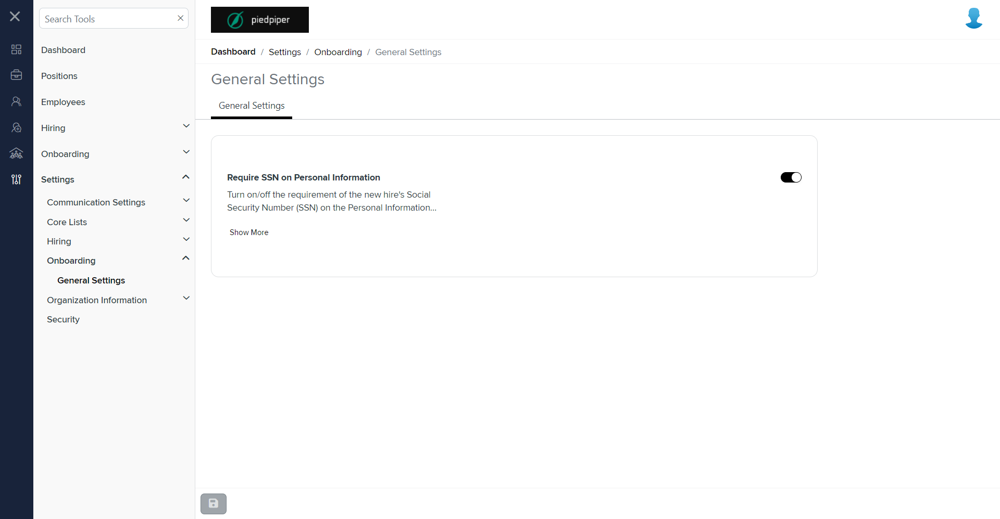

# Summary of `general-settings.component.html`

## Table of Contents

-   [Relative Path](#relative-path)
-   [Summary](#summary)
-   [Prod Screenshots](#prod-screenshots)
-   [Mock Screenshots](#mock-screenshots)
-   [URL](#url)

### Relative Path

-   **general-settings.component.html**: `AgileHR\Talent\Talent.Web\ClientApp\src\app\settings\hiring\settings\general-settings\general-settings.component.html`

### Summary

-   Contains a `<talent-footer>` component with attributes `[nextVisible]`, `[prevVisible]`, `(saveClicked)`, `[saveEnabled]`, and `[saveVisible]`.
-   Contains an `<ng-container>` element with a `[formGroup]` attribute bound to `onboardingSettingForm`.
-   The `<ng-container>` contains a `<settings-table>` component.
-   The `<settings-table>` contains multiple `<settings-row>` components.
-   The first `<settings-row>` component is commented out and has attributes `[title]`, `[description]`, `[required]`, and `[maxLines]`.
-   The first `<settings-row>` component contains a `<toggle-switch>` component with attributes `[form]` and `formControlName`.
-   The second `<settings-row>` component has attributes `[title]`, `[description]`, `[required]`, and `[maxLines]`.
-   The second `<settings-row>` component contains a `<toggle-switch>` component with attributes `[form]`, `formControlName`, and `[enabled]`.
-   The third `<settings-row>` component is commented out and has attributes `[title]`, `[description]`, and `[required]`.
-   The third `<settings-row>` component contains an `<input-dropdown>` component with attributes `[data]`, `[form]`, `formControlName`, `ngDefaultControl`, and `placeholder`.
-   The fourth `<settings-row>` component is commented out and has attributes `[title]`, `[description]`, and `[required]`.
-   The fourth `<settings-row>` component contains a `<toggle-switch>` component with attributes `[form]` and `formControlName`.

### This component is currently not implemented in mock environment.

### Prod Screenshots

### Mock Screenshots

N/A

### URL

[link to the page in prod](https://piedpiper.agilehr.net/core/settings/onboarding/settings)
