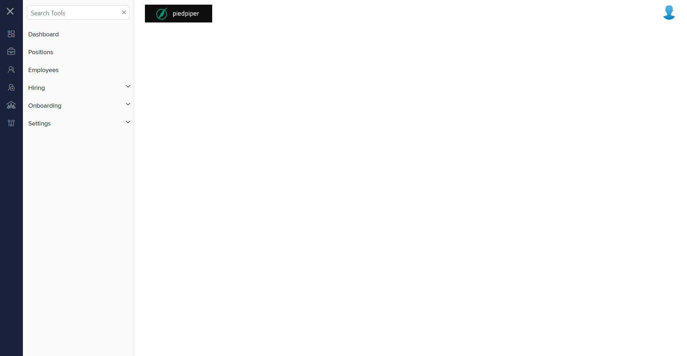

# Summary of `onboarding-settings.component.html`

## Table of Contents

-   [Relative Path](#relative-path)
-   [Summary](#summary)
-   [Prod Screenshots](#prod-screenshots)
-   [Mock Screenshots](#mock-screenshots)
-   [URL](#url)

### Relative Path

-   **onboarding-settings.component.html**: `AgileHR\Talent\Talent.Web\ClientApp\src\app\settings\onboarding\onboarding-settings\onboarding-settings.component.html`

### Summary

-   Contains a `<page-title>` component with a `[title]` attribute set to `'General Settings'`.
-   Contains an `<ejs-tab>` component with `id="adaptiveTab"`, `overflowMode="Popup"`, and `(selected)` event bound to `selected($event)`.
-   The `<ejs-tab>` contains an `<e-tabitems>` component with a single `<e-tabitem>` component.
-   The `<e-tabitem>` component has a `[header]` attribute bound to `headerText[0]`.
-   The `<e-tabitem>` component contains an `<ng-template>` with `#content`.
-   The `<ng-template>` contains a `<talent-general-settings>` component with an `[activeTabIndex]` attribute bound to `activeTabIndex`.

### This component is currently not implemented in mock environment.

### Prod Screenshots

### Mock Screenshots

N/A

### URL

[link to the page in prod](https://piedpiper.agilehr.net/core/settings/onboarding)
