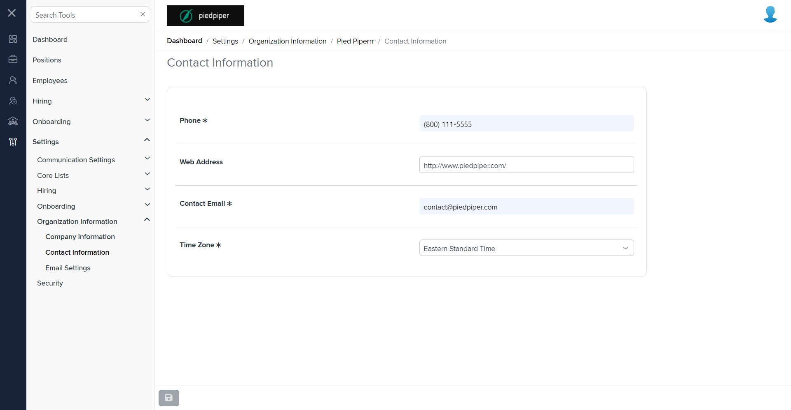
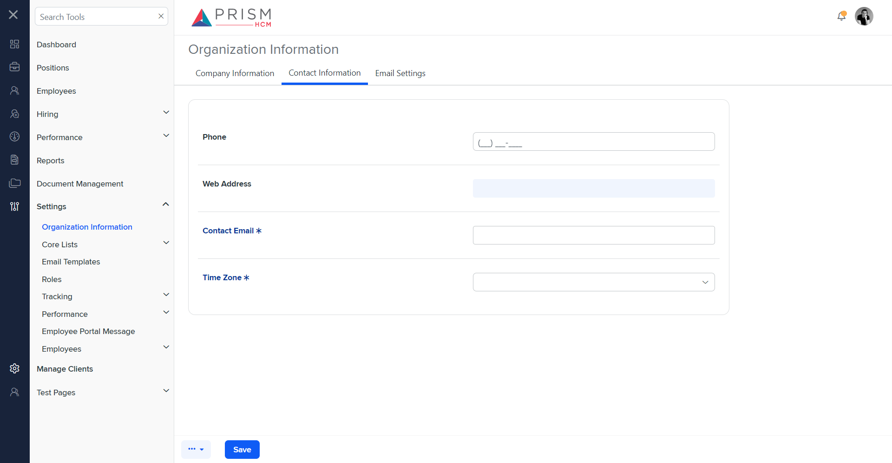

# Differences between `contact.component.html` and `sci.component.html`

## Table of Contents

-   [Relative Paths](#relative-paths)
-   [Differences](#differences)
-   [Prod Screenshots](#prod-screenshots)
-   [Mock Screenshots](#mock-screenshots)
-   [URL](#url)

### Relative Paths

-   **contact.component.html**: `AgileHR\Talent\Talent.Web\ClientApp\src\app\settings\org-info\contact\contact.component.html`
-   **sci.component.html**: `components-ng-shared\projects\mocks-talent-ng\src\app\settings\org-info\sci\sci.component.html`

### Differences

#### AgileHR\Talent\Talent.Web\ClientApp\src\app\settings\org-info\contact\contact.component.html

-   Contains a `<talent-footer>` component with attributes `[nextVisible]`, `[prevVisible]`, `(saveClicked)`, `[saveEnabled]`, and `[saveVisible]`.
-   Contains a `<fieldset>` element with a `[formGroup]` attribute bound to `orgInfoForm` and `[disabled]` bound to `!hasEdit`.
-   The `<fieldset>` contains a `<settings-table>` component with multiple `<settings-row>` components.
-   The first `<settings-row>` component has attributes `[title]`, `[description]`, and `[required]`.
-   The first `<settings-row>` component contains an `<input-phone>` component with attributes `[placeholder]`, `[mask]`, `[form]`, `[required]`, and `formControlName`.
-   The second `<settings-row>` component has attributes `[title]`, `[description]`, and `[required]`.
-   The second `<settings-row>` component contains an `<input-text>` component with attributes `[placeholder]`, `[required]`, `[form]`, and `formControlName`.
-   The third `<settings-row>` component has attributes `[title]`, `[description]`, and `[required]`.
-   The third `<settings-row>` component contains an `<input-text>` component with attributes `[placeholder]`, `[required]`, `[form]`, and `formControlName`.
-   The fourth `<settings-row>` component has attributes `[title]`, `[description]`, and `[required]`.
-   The fourth `<settings-row>` component contains an `<input-dropdown>` component with attributes `[data]`, `[form]`, `formControlName`, `[placeholder]`, `[enableFiltering]`, `[filtering]`, and `[required]`.

#### components-ng-shared\projects\mocks-talent-ng\src\app\settings\org-info\sci\sci.component.html

-   Contains a `<settings-table>` component with multiple `<settings-row>` components.
-   The first `<settings-row>` component has attributes `[title]` and `[required]`.
-   The first `<settings-row>` component contains an `<input-phone>` component with attributes `[placeholder]` and `[mask]`.
-   The second `<settings-row>` component has attributes `[title]` and `[required]`.
-   The second `<settings-row>` component contains an `<input-text>` component with attributes `[placeholder]` and `[required]`.
-   The third `<settings-row>` component has attributes `[title]` and `[required]`.
-   The third `<settings-row>` component contains an `<input-email>` component with a `[placeholder]` attribute.
-   The fourth `<settings-row>` component has attributes `[title]` and `[required]`.
-   The fourth `<settings-row>` component contains an `<input-dropdown>` component with attributes `[data]`, `[placeholder]`, `[enableFiltering]`, `[filtering]`, and `[required]`.

### Prod Screenshots

### Mock Screenshots

### URL

[link to the page in prod](https://piedpiper.agilehr.net/core/settings/org-info/contact)

[link to the page in mock environment](http://localhost:4340/settings/organization-information)
