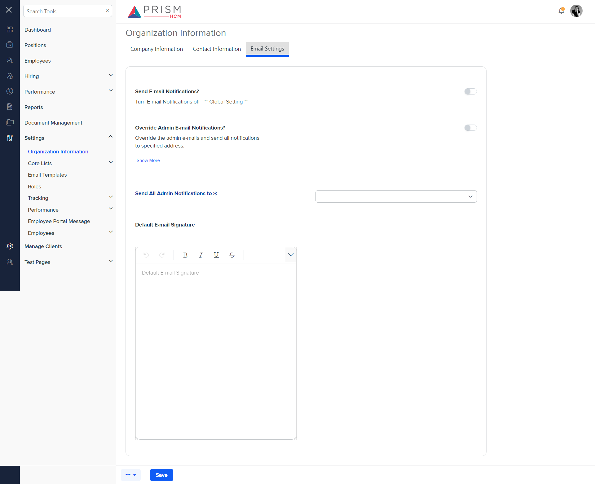
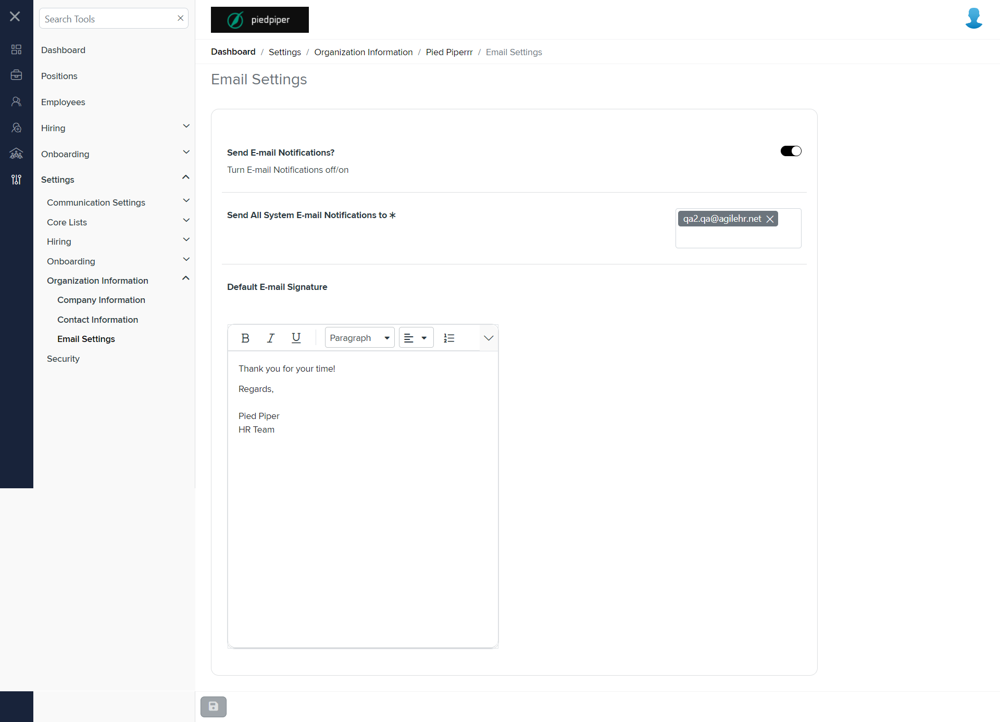

# Differences between `email.component.html` and `ses.component.html`

## Table of Contents

-   [Relative Paths](#relative-paths)
-   [Differences](#differences)
-   [Prod Screenshots](#prod-screenshots)
-   [Mock Screenshots](#mock-screenshots)
-   [URL](#url)

### Relative Paths

-   **email.component.html**: `AgileHR\Talent\Talent.Web\ClientApp\src\app\settings\org-info\email\email.component.html`
-   **ses.component.html**: `components-ng-shared\projects\mocks-talent-ng\src\app\settings\org-info\ses\ses.component.html`

### Differences

#### AgileHR\Talent\Talent.Web\ClientApp\src\app\settings\org-info\email\email.component.html

-   Contains a `<page-title>` component with a `[title]` attribute set to `'Email Settings'`.
-   Contains a `<talent-footer>` component with attributes `[nextVisible]`, `[prevVisible]`, `(saveClicked)`, `[saveEnabled]`, and `[saveVisible]`.
-   Contains a `<fieldset>` element with a `[formGroup]` attribute bound to `orgInfoForm` and `[disabled]` bound to `!hasEdit`.
-   The `<fieldset>` contains a `<settings-table>` component with multiple `<settings-row>` components.
-   The first `<settings-row>` component has attributes `title`, `description`, and `[required]`.
-   The first `<settings-row>` component contains a `<toggle-switch>` component with attributes `[form]`, `formControlName`, and `[enabled]`.
-   The second `<settings-row>` component has attributes `title` and `[required]`.
-   The second `<settings-row>` component contains an `<ejs-multiselect>` component with attributes `id`, `[value]`, `[dataSource]`, `[allowCustomValue]`, `(tagging)`, `(removing)`, `mode`, `placeholder`, and `[fields]`.
-   The second `<settings-row>` component contains a `
` element with an `*ngIf` directive bound to `currentEmailValuesErrors() | async` and class `error-message custom-error-message`.
-   The third `<settings-row>` component has attributes `title`, `description`, and `type`.
-   The third `<settings-row>` component contains an `<input-rich-text>` component with attributes `id`, `[form]`, `[toolbarSettings]`, `formControlName`, and `[enabled]`.

#### components-ng-shared\projects\mocks-talent-ng\src\app\settings\org-info\ses\ses.component.html

-   Contains a `<settings-row>` component with attributes `[title]`, `[description]`, and `[required]`.
-   The first `<settings-row>` component contains a `<toggle-switch>` component.
-   Contains a `<settings-row>` component with attributes `[title]`, `[description]`, and `[required]`.
-   The second `<settings-row>` component contains a `<toggle-switch>` component.
-   Contains a `<settings-row>` component with attributes `[title]` and `[required]`.
-   The third `<settings-row>` component contains an `<input-dropdown>` component with attributes `[data]`, `[placeholder]`, `[enableFiltering]`, `[filtering]`, and `[required]`.
-   Contains a `<settings-row>` component with attributes `[title]` and `[type]`.
-   The fourth `<settings-row>` component contains an `<input-rich-text>` component with a `[placeholder]` attribute.

### Prod Screenshots

### Mock Screenshots

### URL

[link to the page in prod](https://piedpiper.agilehr.net/core/settings/org-info/email)

[link to the page in mock environment](information)
