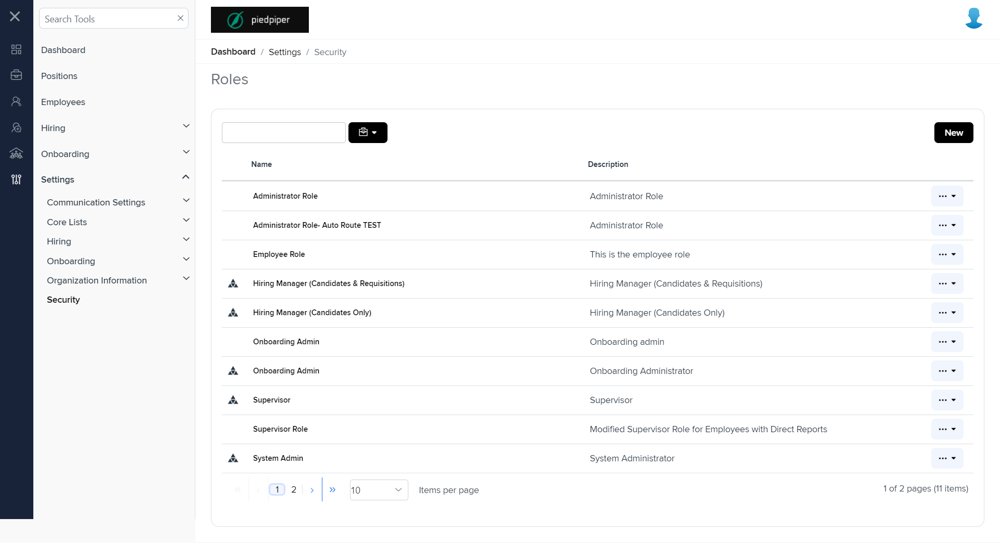
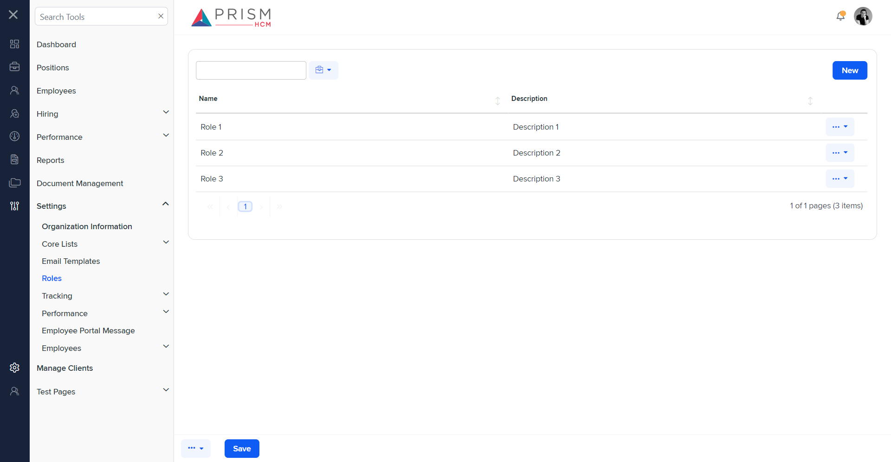

# Differences between `security.component.html` and `roles.component.html`

## Table of Contents

-   [Relative Paths](#relative-paths)
-   [Differences](#differences)
-   [Prod Screenshots](#prod-screenshots)
-   [Mock Screenshots](#mock-screenshots)
-   [URL](#url)

### Relative Paths

-   **security.component.html**: `AgileHR\Talent\Talent.Web\ClientApp\src\app\settings\security\security.component.html`
-   **roles.component.html**: `components-ng-shared\projects\mocks-talent-ng\src\app\settings\roles\roles.component.html`

### Differences

#### AgileHR\Talent\Talent.Web\ClientApp\src\app\settings\security\security.component.html

-   Contains a `<page-title>` component with a `[title]` attribute set to `'Roles'`.
-   Contains a `<talent-grid>` component with various attributes such as `[allowBulkActions]`, `[allowFiltering]`, `[allowNew]`, `[allowRowSelect]`, `[data]`, `exportFileName`, `friendlyName`, `idProperty`, `[initializing]`, `[searchFields]`, `(selected)`, and `[selectOptions]`.
-   The `<talent-grid>` contains an `<e-columns>` component with multiple `<e-column>` components.
-   The first `<e-column>` component has attributes `field`, `headerText`, and `width`.
-   The first `<e-column>` component contains an `<ng-template>` with `#template` and `let-data`.
-   The `<ng-template>` contains an `<ejs-tooltip>` component with attributes `#tooltip` and `content`.
-   The `<ejs-tooltip>` contains a `` element with class `fa-xl prism-icons-prism`.
-   The second `<e-column>` component has attributes `field` and `headerText`.
-   The second `<e-column>` component contains an `<ng-template>` with `*hasKey`, `#template`, and `let-data`.
-   The `<ng-template>` contains an `<ejs-tooltip>` component with attributes `#tooltip` and `[content]`.
-   The `<ejs-tooltip>` contains an `<a>` element with class `grid-link disable-row-select` and a `(click)` event.
-   The third `<e-column>` component has attributes `field` and `headerText`.
-   Contains multiple `<modal-base>` components with `[config]` and `[template]` attributes for `deleteModal`, `copyModal`, and `editSetupModal`.
-   Contains multiple `<ng-template>` elements with `#deleteContent`, `#copyContent`, and `#editSetupContent`.
-   The `<ng-template>` elements contain nested `
` elements with class `row` and `col-xs-12`.
-   The `<ng-template>` elements contain confirmation messages.
-   The `<ng-template>` with `#editSetupContent` contains a `<settings-table>` component with multiple `<settings-row>` components.
-   The `<settings-row>` components have attributes `[title]`, `[description]`, and `[required]`.
-   The `<settings-row>` components contain various input components such as `<input-text>` and `<toggle-switch>`.
-   The `<input-text>` components have attributes `[placeholder]`, `[required]`, `[enabled]`, `[form]`, and `formControlName`.
-   The `<toggle-switch>` components have attributes `(check)`, `[enabled]`, and `[formControl]`.

#### components-ng-shared\projects\mocks-talent-ng\src\app\settings\roles\roles.component.html

-   Contains a `<grid-filters>` component with attributes `[centerTemplate]` and `[centerHeaderTemplate]`.
-   The `<grid-filters>` contains an `<ng-template>` with `#centerHeaderTemplate` and a nested `
` element with class `custom-toolbar`.
-   The `
` contains nested `
` elements with classes `custom-toolbar__wrapper`, `custom-toolbar__lc`, and `custom-toolbar__rc`.
-   The `
` contains an `<input-text>` component with attributes `[placeholder]` and `[cssClass]`.
-   The `
` contains a `<button-dropdown-grid>` component with attributes `[items]`, `tooltip`, `[icon]`, and `[callback]`.
-   The `
` contains a `<button-base>` component with attributes `[title]`, `[tooltip]`, `(click)`, `onKeyPress`, `onKeyDown`, and `onKeyUp`.
-   The `<grid-filters>` contains an `<ng-template>` with `#centerContent` and a nested `<ejs-grid>` component with attributes `[enableAdaptiveUI]`, `[rowRenderingMode]`, `[allowPaging]`, `[dataSource]`, and `[allowSorting]`.
-   The `<ejs-grid>` contains an `<e-columns>` component with multiple `<e-column>` components.
-   The first `<e-column>` component has attributes `field` and `headerText`.
-   The second `<e-column>` component has attributes `field`, `headerText`, and `width`.
-   The third `<e-column>` component has attributes `field`, `textAlign`, `[template]`, and `width`.
-   Contains multiple `<ng-template>` elements with `#editbutton`, `#searchbar`, `#deleteContent`, `#copyContent`, `#newTypeContent`, and `#editSetupContent`.
-   The `<ng-template>` elements contain nested components such as `<button-dropdown-grid>`, `<input-text>`, and `<settings-table>`.
-   The `<settings-table>` components contain multiple `<settings-row>` components.
-   The `<settings-row>` components have attributes `[title]`, `[required]`, and `[type]`.
-   The `<settings-row>` components contain various input components such as `<input-text>` and `<settings-tree>`.
-   The `<input-text>` components have attributes `[placeholder]`, `[required]`, and `[floatLabelType]`.
-   The `<settings-tree>` components have attributes `[data]`.

### Prod Screenshots

### Mock Screenshots

### URL

[link to the page in prod](https://piedpiper.agilehr.net/core/settings/security)

[link to the page in mock environment](http://localhost:4340/settings/roles)
